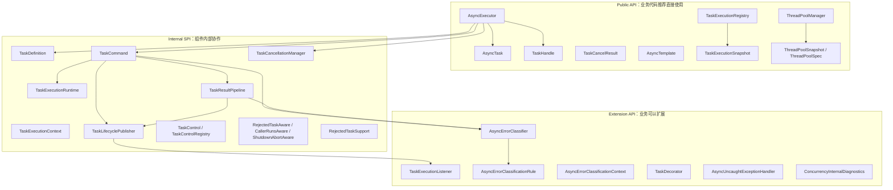
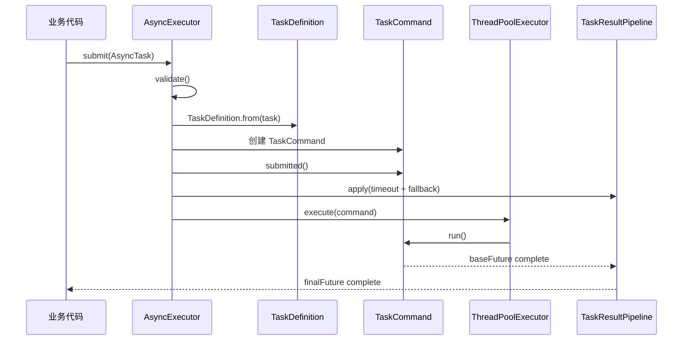

# API_GUIDE：接口使用与分层说明

> 本文档用于说明 `concurrency-component` 中哪些接口是业务代码可以直接使用的，哪些接口是业务可以扩展的，哪些接口只属于组件内部协作，不建议业务直接调用。  
> 阅读本文后，业务开发可以知道“我该用哪个入口”，组件维护者可以知道“每个内部接口处在什么位置”。

---

## 本文适合谁看

本文适合以下几类人：

1. **业务开发**：想知道如何提交异步任务、如何拿返回值、如何设置超时、如何使用 fallback、如何取消任务。
2. **组件维护者**：想知道组件内部有哪些核心接口，以及这些接口之间如何协作。
3. **排障人员**：想知道任务失败、超时、拒绝、取消时应该从哪个对象或接口查看状态。
4. **后续扩展者**：想新增错误分类规则、任务监听器、上下文传播、线程池治理能力。

---

## 读完你会知道什么

读完本文后，你应该能回答以下问题：

- 哪些接口是业务代码可以直接调用的？
- 哪些接口是业务可以实现的扩展点？
- 哪些类只是组件内部实现，业务不应该直接调用？
- `AsyncExecutor` 每个方法分别适合什么场景？
- `AsyncTask` 每个参数是什么意思？
- `TaskHandle` 和 `AsyncExecutor.cancel(taskId)` 有什么区别？
- `AsyncTemplate` 和 `AsyncExecutor` 有什么区别？
- 为什么 `TaskCommand`、`TaskExecutionRuntime`、`TaskResultPipeline` 不应该由业务直接使用？
- 遇到任务失败、拒绝、超时、取消时，应该从哪个接口排查？

---

## 目录

- [1. API 分层总览](#1-api-分层总览)
  - [1.1 三类 API](#11-三类-api)
  - [1.2 API 边界图](#12-api-边界图)
  - [1.3 业务代码应该依赖哪一层](#13-业务代码应该依赖哪一层)
- [2. Public API：业务代码推荐直接使用](#2-public-api业务代码推荐直接使用)
  - [2.1 AsyncExecutor](#21-asyncexecutor)
  - [2.2 AsyncTask](#22-asynctask)
  - [2.3 TaskHandle](#23-taskhandle)
  - [2.4 TaskCancelResult](#24-taskcancelresult)
  - [2.5 AsyncTemplate](#25-asynctemplate)
  - [2.6 TaskExecutionRegistry](#26-taskexecutionregistry)
  - [2.7 TaskExecutionSnapshot](#27-taskexecutionsnapshot)
  - [2.8 ThreadPoolManager](#28-threadpoolmanager)
  - [2.9 ThreadPoolSnapshot](#29-threadpoolsnapshot)
  - [2.10 ThreadPoolSpec](#210-threadpoolspec)
- [3. Extension API：业务可以扩展的接口](#3-extension-api业务可以扩展的接口)
  - [3.1 TaskExecutionListener](#31-taskexecutionlistener)
  - [3.2 AsyncErrorClassificationRule](#32-asyncerrorclassificationrule)
  - [3.3 AsyncErrorClassifier](#33-asyncerrorclassifier)
  - [3.4 AsyncErrorClassificationContext](#34-asyncerrorclassificationcontext)
  - [3.5 TaskDecorator](#35-taskdecorator)
  - [3.6 AsyncUncaughtExceptionHandler](#36-asyncuncaughtexceptionhandler)
  - [3.7 ConcurrencyInternalDiagnostics](#37-concurrencyinternaldiagnostics)
- [4. Internal SPI：组件内部协作接口](#4-internal-spi组件内部协作接口)
  - [4.1 TaskDefinition](#41-taskdefinition)
  - [4.2 TaskExecutionContext](#42-taskexecutioncontext)
  - [4.3 TaskExecutionRuntime](#43-taskexecutionruntime)
  - [4.4 TaskCommand](#44-taskcommand)
  - [4.5 TaskResultPipeline](#45-taskresultpipeline)
  - [4.6 TaskLifecyclePublisher](#46-tasklifecyclepublisher)
  - [4.7 TaskControl](#47-taskcontrol)
  - [4.8 TaskControlRegistry](#48-taskcontrolregistry)
  - [4.9 TaskCancellationManager](#49-taskcancellationmanager)
  - [4.10 RejectedTaskAware](#410-rejectedtaskaware)
  - [4.11 CallerRunsAware](#411-callerrunsaware)
  - [4.12 ShutdownAbortAware](#412-shutdownabortaware)
  - [4.13 RejectedTaskSupport](#413-rejectedtasksupport)
  - [4.14 RejectedExecutionHandler 实现类](#414-rejectedexecutionhandler-实现类)
- [5. API 选择指南](#5-api-选择指南)
- [6. 不建议业务直接使用的类](#6-不建议业务直接使用的类)
- [7. 常见误区](#7-常见误区)
- [8. 小结](#8-小结)

---

# 1. API 分层总览

并行组件的接口不能简单按“类名”理解，而应该按**使用边界**理解。

有的接口是业务开发应该直接使用的，例如 `AsyncExecutor`、`AsyncTask`。  
有的接口是业务可以实现的扩展点，例如 `TaskExecutionListener`、`AsyncErrorClassificationRule`。  
还有一些接口只是组件内部协作使用，例如 `TaskCommand`、`TaskExecutionRuntime`、`TaskResultPipeline`。

如果不区分这些层次，很容易出现下面的问题：

- 业务代码直接 new `TaskCommand`，绕过状态机和生命周期发布。
- 业务代码直接修改 `TaskExecutionRuntime`，导致状态混乱。
- 业务代码直接调用 `TaskResultPipeline`，导致 `SUBMITTED`、`RUNNING`、`TIMEOUT` 事件顺序异常。
- 业务代码直接使用 `RejectedTaskSupport`，导致任务 Future 被错误完成。
- 业务代码把内部 SPI 当成稳定 API，后续组件升级时无法兼容。

因此本文将 API 分为三层：

```text
Public API
  业务代码可以直接使用。

Extension API
  业务代码可以实现，用于扩展组件能力。

Internal SPI
  组件内部协作接口，不建议业务直接调用。
```

---

## 1.1 三类 API

| 类型 | 面向对象 | 是否建议业务直接调用 | 示例 |
|---|---|---:|---|
| Public API | 业务开发 | 是 | `AsyncExecutor`、`AsyncTask`、`TaskHandle`、`AsyncTemplate` |
| Extension API | 业务扩展者 | 可以实现，不主动调用主流程 | `TaskExecutionListener`、`AsyncErrorClassificationRule` |
| Internal SPI | 组件维护者 | 否 | `TaskCommand`、`TaskExecutionRuntime`、`TaskResultPipeline` |

---

## 1.2 API 边界图



这张图可以按下面方式理解：

- 业务代码主要从 `AsyncExecutor` 进入。
- `AsyncExecutor` 会把业务传入的 `AsyncTask` 转成内部不可变快照 `TaskDefinition`。
- 真正进入线程池执行的是 `TaskCommand`。
- 任务执行过程中的状态变化由 `TaskExecutionRuntime` 控制。
- timeout 和 fallback 由 `TaskResultPipeline` 处理。
- 事件、指标、注册表、监听器由 `TaskLifecyclePublisher` 统一发布。
- 业务扩展错误分类时，实现 `AsyncErrorClassificationRule`。
- 业务扩展任务监听时，实现 `TaskExecutionListener`。

---

## 1.3 业务代码应该依赖哪一层

业务代码应该优先依赖：

```text
AsyncExecutor
AsyncTask
TaskHandle
AsyncTemplate
TaskExecutionRegistry
ThreadPoolManager
TaskExecutionListener
AsyncErrorClassificationRule
```

业务代码不应该直接依赖：

```text
TaskCommand
TaskExecutionRuntime
TaskExecutionContext
TaskResultPipeline
TaskLifecyclePublisher
RejectedTaskSupport
```

原因很简单：这些内部类通常有严格调用顺序，如果业务直接调用，很容易破坏组件主链路。

---

# 2. Public API：业务代码推荐直接使用

Public API 是业务代码最应该关注的部分。

这一层的目标是让业务方不用直接接触 `ThreadPoolExecutor`、`CompletableFuture` 的复杂细节，也能拥有：

- 指定线程池。
- 异步执行。
- 获取返回值。
- 设置 timeout。
- 设置 fallback。
- 感知拒绝。
- 主动取消。
- 查询状态。
- 接入监听器和指标。

---

## 2.1 AsyncExecutor

### 2.1.1 它是什么

`AsyncExecutor` 是业务提交异步任务的统一入口。

你可以把它理解成组件封装后的“增强版异步执行器”。它不是简单的 `ExecutorService`，因为它额外处理了：

- 任务元数据。
- 线程池选择。
- 状态机。
- 排队超时。
- 结果超时。
- fallback。
- 拒绝感知。
- 主动取消。
- 任务快照。
- 指标和监听器。

### 2.1.2 业务是否可以直接使用

可以，而且推荐业务代码优先使用它。

业务代码不建议直接使用：

```java
ThreadPoolExecutor
CompletableFuture.supplyAsync(...)
new Thread(...)
```

而是建议统一使用：

```java
asyncExecutor.submit(...)
asyncExecutor.supply(...)
asyncExecutor.run(...)
```

这样可以保证所有异步任务都被组件接管。

---

### 2.1.3 常用方法总览

| 方法 | 返回值 | 是否关心结果 | 是否支持完整任务配置 | 适用场景 |
|---|---|---:|---:|---|
| `submit(AsyncTask<T>)` | `CompletableFuture<T>` | 是 | 是 | 推荐的标准提交方式 |
| `submitHandle(AsyncTask<T>)` | `TaskHandle<T>` | 是 | 是 | 需要后续取消任务 |
| `supply(executorName, taskName, supplier)` | `CompletableFuture<T>` | 是 | 否 | 简单有返回值任务 |
| `run(executorName, taskName, runnable)` | `CompletableFuture<Void>` | 是 | 否 | 简单无返回值任务 |
| `execute(executorName, taskName, runnable)` | `void` | 否 | 否 | fire-and-forget |
| `tryExecute(executorName, taskName, runnable)` | `boolean` | 否 | 否 | 尝试提交，不希望抛异常 |
| `cancel(taskId, mayInterrupt)` | `TaskCancelResult` | - | - | 根据 taskId 取消任务 |

---

### 2.1.4 submit：提交完整任务

#### 作用

`submit` 用于提交一个完整的 `AsyncTask`。

它适合需要完整控制能力的任务，例如：

- 自定义 taskId。
- 设置 bizKey。
- 设置 tags。
- 设置 timeout。
- 设置 queueTimeout。
- 设置 fallback。
- 设置 cancelOnTimeout。
- 设置 interruptOnTimeout。

#### 示例

```java
CompletableFuture<UserDTO> future = asyncExecutor.submit(
        AsyncTask.of(
                        "biz-query-pool",
                        "queryUserProfile",
                        () -> userService.queryProfile(userId)
                )
                .bizKey("userId=" + userId)
                .tag("scene", "profile")
                .timeout(Duration.ofSeconds(2))
                .queueTimeout(Duration.ofMillis(200))
                .cancelOnTimeout(true)
                .interruptOnTimeout(true)
                .fallback(error -> UserDTO.empty(userId))
);

UserDTO result = future.join();
```

#### 内部流转



#### 注意事项

`submit` 返回的是最终 `finalFuture`，不是内部的 `baseFuture`。

可以这样理解：

```text
baseFuture
  原始任务结果，只表达 operation 成功、失败、超时、拒绝、取消。

finalFuture
  业务最终看到的结果，可能经过 timeout 和 fallback 处理。
```

如果原始任务失败但 fallback 成功，那么：

```text
baseFuture = failed
finalFuture = success(fallbackValue)
```

---

### 2.1.5 submitHandle：提交任务并返回句柄

#### 作用

`submitHandle` 适合需要后续取消任务的场景。

例如：

- 用户在页面取消查询。
- 批量任务中止。
- 管理接口取消某个 taskId。
- 长耗时任务需要外部控制。

#### 示例

```java
TaskHandle<ReportDTO> handle = asyncExecutor.submitHandle(
        AsyncTask.of(
                        "report-pool",
                        "generateReport",
                        () -> reportService.generate(reportId)
                )
                .taskId("report-" + reportId)
                .timeout(Duration.ofSeconds(30))
);

CompletableFuture<ReportDTO> future = handle.getFuture();

TaskCancelResult cancelResult = handle.cancel(true);
```

#### 返回对象

`TaskHandle<T>` 通常包含：

| 方法 | 说明 |
|---|---|
| `getTaskId()` | 当前任务 ID |
| `getFuture()` | 当前任务最终 Future |
| `cancel(boolean)` | 取消当前任务 |

#### 注意事项

推荐使用：

```java
handle.cancel(true);
```

而不是直接：

```java
handle.getFuture().cancel(true);
```

因为直接取消原生 Future 可能无法完整触发组件内部的状态、事件、注册表和指标。

---

### 2.1.6 supply：快速提交有返回值任务

#### 作用

`supply` 是快捷方法，适合简单有返回值的异步任务。

#### 示例

```java
CompletableFuture<UserDTO> future = asyncExecutor.supply(
        "biz-query-pool",
        "queryUser",
        () -> userService.query(userId)
);
```

#### 适用场景

适合：

- 简单异步查询。
- 不需要单独设置 timeout。
- 不需要单独设置 fallback。
- 不需要自定义 bizKey / tags。
- 不需要取消句柄。

如果需要完整控制，建议使用 `submit(AsyncTask)`。

---

### 2.1.7 run：快速提交无返回值任务

#### 作用

`run` 适合提交无返回值但仍然希望知道是否完成的任务。

#### 示例

```java
CompletableFuture<Void> future = asyncExecutor.run(
        "default",
        "syncUserTag",
        () -> tagService.sync(userId)
);

future.whenComplete((unused, error) -> {
    if (error == null) {
        log.info("标签同步成功");
    } else {
        log.warn("标签同步失败", error);
    }
});
```

#### 和 execute 的区别

| 方法 | 是否返回 Future | 是否适合排障 |
|---|---:|---:|
| `run` | 是 | 更适合 |
| `execute` | 否 | 只能依赖监听器、日志、指标 |

如果业务需要知道任务成功失败，用 `run`。  
如果业务完全不关心结果，用 `execute`。

---

### 2.1.8 execute：fire-and-forget

#### 作用

`execute` 用于提交不关心结果的任务。

#### 示例

```java
asyncExecutor.execute(
        "default",
        "sendAuditLog",
        () -> auditService.send(logDTO)
);
```

#### 注意事项

虽然业务不拿返回值，但组件内部仍然会：

- 创建任务状态。
- 记录指标。
- 触发监听器。
- 感知拒绝。
- 处理异常。

如果任务异常，通常会进入：

```text
AsyncUncaughtExceptionHandler
TaskExecutionListener
Metrics
Registry
```

---

### 2.1.9 tryExecute：尝试提交

#### 作用

`tryExecute` 适合“不想抛异常，只想知道有没有提交成功”的场景。

#### 示例

```java
boolean accepted = asyncExecutor.tryExecute(
        "default",
        "sendLog",
        () -> auditService.send(logDTO)
);

if (!accepted) {
    log.warn("审计日志异步任务没有被接受");
}
```

#### 适用场景

适合：

- 日志类任务。
- 低优先级通知。
- 可丢弃或可降级的后台动作。
- 不希望影响主流程的异步动作。

#### 注意事项

`tryExecute=false` 不代表一定没有任何记录。  
如果组件已经创建了任务并感知到拒绝，Registry、Metrics、Listener 仍然可能记录到 `REJECTED`。

---

### 2.1.10 cancel：根据 taskId 取消任务

#### 作用

`cancel(taskId, mayInterruptIfRunning)` 用于根据任务 ID 取消任务。

#### 示例

```java
TaskCancelResult result = asyncExecutor.cancel(
        "report-10001",
        true
);
```

#### 返回值

| 返回值 | 含义 |
|---|---|
| `CANCELLED` | 取消成功 |
| `ALREADY_COMPLETED` | 任务已经结束，无法取消 |
| `NOT_FOUND` | 当前节点找不到该任务 |

#### 注意事项

当前取消能力通常是**当前 JVM 节点内取消**。

如果任务未来运行在多个节点上，`cancel(taskId)` 需要结合：

- taskId 路由。
- 分布式任务注册表。
- 节点心跳。
- 分布式控制事件。

一期不要把本地取消理解成分布式取消。

---

## 2.2 AsyncTask

### 2.2.1 它是什么

`AsyncTask<T>` 是业务提交任务时使用的完整任务模型。

它描述：

- 任务交给哪个线程池执行。
- 任务叫什么名字。
- 任务 ID 是什么。
- 业务 key 是什么。
- 有哪些 tags。
- 任务逻辑是什么。
- 超时时间是什么。
- fallback 是什么。
- 超时后是否取消底层任务。
- 超时取消时是否中断线程。
- 是否传播上下文。

可以把它理解为：

```text
一次异步任务提交请求
```

---

### 2.2.2 业务是否可以直接使用

可以，而且当你需要完整控制能力时，推荐使用。

简单任务可以用：

```java
asyncExecutor.supply(...)
asyncExecutor.run(...)
```

复杂任务建议用：

```java
asyncExecutor.submit(AsyncTask.of(...))
```

---

### 2.2.3 常用参数

| 参数 | 说明 | 是否必填 |
|---|---|---:|
| `executorName` | 使用哪个线程池 | 是 |
| `taskName` | 任务名称 | 是 |
| `operation` | 任务执行逻辑 | 是 |
| `taskId` | 任务唯一 ID | 否，不传自动生成 |
| `bizKey` | 业务 key | 否 |
| `description` | 任务描述 | 否 |
| `tags` | 标签 | 否 |
| `timeout` | 结果超时 | 否 |
| `queueTimeout` | 排队超时 | 否 |
| `cancelOnTimeout` | 结果超时后是否取消底层任务 | 否 |
| `interruptOnTimeout` | 超时取消时是否 interrupt 工作线程 | 否 |
| `fallback` | 失败、超时、拒绝后的降级逻辑 | 否 |
| `contextPropagation` | 是否传播上下文 | 否 |
| `retryPolicy` | 重试策略元数据 | 否 |

---

### 2.2.4 executorName

`executorName` 表示任务提交到哪个线程池。

示例：

```java
AsyncTask.of(
        "biz-query-pool",
        "queryUser",
        () -> userService.query(userId)
);
```

对应配置：

```yaml
xjtu:
  iron:
    concurrency:
      thread-pools:
        biz-query-pool:
          core-pool-size: 8
          max-pool-size: 16
          queue-capacity: 1000
```

如果 `executorName` 不存在，一般应该在提交时失败。

---

### 2.2.5 taskName

`taskName` 表示任务名称。

它用于：

- 日志。
- 指标 tag。
- 任务快照。
- 监听器。
- 错误分类。
- 排障。

建议使用稳定名称，不要把 userId、orderId 等高基数字段放进 `taskName`。

推荐：

```text
queryUserProfile
sendAuditLog
generateReport
consumePaymentMessage
```

不推荐：

```text
queryUserProfile-10001
sendAuditLog-user-8888
```

高基数字段应该放在：

```text
bizKey
tags
```

---

### 2.2.6 taskId

`taskId` 是任务唯一 ID。

如果业务不传，组件可以自动生成。

建议业务在需要取消或查询时显式传入：

```java
.taskId("report-" + reportId)
```

后续可以用：

```java
asyncExecutor.cancel("report-" + reportId, true);
taskExecutionRegistry.get("report-" + reportId);
```

---

### 2.2.7 bizKey

`bizKey` 是业务标识。

例如：

```java
.bizKey("orderId=" + orderId)
```

它适合用于：

- 排障。
- 日志。
- 任务快照。
- 业务聚合。
- 补偿定位。

注意：`bizKey` 不建议作为 Micrometer tag，避免高基数。

---

### 2.2.8 tags

`tags` 是任务标签。

示例：

```java
.tag("scene", "payment")
.tag("priority", "high")
.tag("source", "mq")
```

建议 tags 使用低基数字段。

适合放：

```text
scene=payment
source=mq
priority=high
```

不适合放：

```text
userId=10001
orderId=202606260001
```

---

### 2.2.9 timeout

`timeout` 是**结果层超时**。

意思是：

```text
从任务提交后开始计算，如果最终结果在指定时间内没有完成，就让 finalFuture 进入超时逻辑。
```

示例：

```java
.timeout(Duration.ofSeconds(2))
```

timeout 触发后，如果配置了 fallback，则会进入 fallback。

---

### 2.2.10 queueTimeout

`queueTimeout` 是**排队超时**。

意思是：

```text
任务提交到线程池后，如果在线程池队列中等待太久，真正开始 run 时发现已经超过 queueTimeout，就不再执行原始 operation。
```

示例：

```java
.queueTimeout(Duration.ofMillis(200))
```

queueTimeout 主要防止任务在队列里积压太久，开始执行时已经没有意义。

---

### 2.2.11 timeout 和 queueTimeout 的区别

| 参数 | 计算对象 | 触发位置 | 解决什么问题 |
|---|---|---|---|
| `queueTimeout` | 排队等待时间 | `TaskCommand.run()` 开始前 | 队列里等太久 |
| `timeout` | 最终结果等待时间 | `TaskResultPipeline` | 整体执行太久 |

简单理解：

```text
queueTimeout
  还没开始执行，就已经等太久。

timeout
  从提交到最终结果，整体等太久。
```

---

### 2.2.12 cancelOnTimeout

`cancelOnTimeout` 表示结果超时后是否尝试取消底层原始任务。

```java
.cancelOnTimeout(true)
```

如果为 `true`，timeout 触发后会尝试让原始任务收口为超时，并根据配置决定是否中断线程。

---

### 2.2.13 interruptOnTimeout

`interruptOnTimeout` 表示 timeout 触发后，如果要取消底层任务，是否向运行线程发送 interrupt。

```java
.cancelOnTimeout(true)
.interruptOnTimeout(true)
```

注意：

```text
interrupt 不是强制杀死线程。
```

它只是给线程发送中断信号。业务代码、HTTP 客户端、数据库驱动是否响应中断，取决于具体实现。

---

### 2.2.14 fallback

`fallback` 是失败、超时、拒绝后的降级逻辑。

示例：

```java
.fallback(error -> UserDTO.empty(userId))
```

它可能在以下场景触发：

- 原始任务失败。
- 原始任务超时。
- 线程池拒绝。
- 其他可恢复异常。

fallback 成功时，最终 Future 会正常返回 fallback 值。

---

### 2.2.15 contextPropagation

表示是否传播上下文。

例如：

- MDC。
- traceId。
- requestId。
- 用户上下文。
- 租户上下文。

示例：

```java
.contextPropagation(true)
```

具体传播能力依赖组件提供的 `TaskDecorator` 或上下文传播实现。

---

### 2.2.16 retryPolicy

`retryPolicy` 当前更多是任务元数据，表示任务是否具备重试语义。

建议一期不要把复杂业务重试放在并行组件内部。

更推荐后续单独做：

```text
retry-component
compensation-component
```

并让并行组件输出结构化错误和恢复建议。

---

## 2.3 TaskHandle

### 2.3.1 它是什么

`TaskHandle<T>` 是任务提交后的控制句柄。

它通常包含：

- taskId。
- finalFuture。
- cancel 方法。

### 2.3.2 什么时候使用

当你需要后续取消任务时，使用：

```java
TaskHandle<T> handle = asyncExecutor.submitHandle(task);
```

而不是：

```java
CompletableFuture<T> future = asyncExecutor.submit(task);
```

---

### 2.3.3 示例

```java
TaskHandle<String> handle = asyncExecutor.submitHandle(
        AsyncTask.of(
                        "default",
                        "longTask",
                        () -> longRunningService.call()
                )
                .taskId("long-task-1")
);

CompletableFuture<String> future = handle.getFuture();

TaskCancelResult result = handle.cancel(true);
```

---

### 2.3.4 cancel(boolean)

`cancel(true)` 表示取消任务，并尝试中断运行线程。

`cancel(false)` 表示取消任务，但不主动中断运行线程。

注意：

```text
cancel(true) 不保证一定立刻停止运行中的业务代码。
```

因为 Java 中断是协作式机制。

---

## 2.4 TaskCancelResult

### 2.4.1 它是什么

`TaskCancelResult` 表示取消任务的结果。

常见值：

```text
CANCELLED
ALREADY_COMPLETED
NOT_FOUND
```

---

### 2.4.2 含义

| 结果 | 含义 | 说明 |
|---|---|---|
| `CANCELLED` | 取消成功 | 任务被取消，Future 通常会进入 cancelled 或异常完成状态 |
| `ALREADY_COMPLETED` | 已经完成 | 任务已经 SUCCESS / FAILED / TIMEOUT / REJECTED / FALLBACK_SUCCESS / FALLBACK_FAILED |
| `NOT_FOUND` | 未找到 | 当前节点没有这个 taskId |

---

### 2.4.3 使用建议

如果使用的是本地任务取消：

```java
asyncExecutor.cancel(taskId, true)
```

那么 `NOT_FOUND` 只说明当前 JVM 没找到这个任务，不代表其他节点没有。

后续如果做分布式取消，需要结合：

- 节点路由。
- 分布式注册表。
- 任务心跳。
- 控制消息。

---

## 2.5 AsyncTemplate

### 2.5.1 它是什么

`AsyncTemplate` 是通用 `CompletableFuture` 编排工具。

它和 `AsyncExecutor` 的区别是：

| 对象 | 作用 |
|---|---|
| `AsyncExecutor` | 提交组件托管的异步任务 |
| `AsyncTemplate` | 编排已经存在的 `CompletableFuture` |

简单说：

```text
AsyncExecutor
  管任务提交、线程池、状态、指标、fallback、取消。

AsyncTemplate
  管多个 Future 怎么组合、怎么等待、怎么聚合结果。
```

---

### 2.5.2 常用方法

| 方法 | 含义 | 特点 |
|---|---|---|
| `allOf` | 等全部成功 | 有一个失败，整体失败 |
| `anyOf` | 任意一个完成 | 成功或失败都算完成 |
| `anySuccess` | 任意一个成功 | 忽略失败，直到有成功 |
| `allOfOutcome` | 等全部完成并返回每个结果 | 不因单个失败提前失败 |
| `allOfFailFast` | 任一失败立即失败 | 快速失败 |
| `withTimeout` | 给 Future 增加超时视图 | 非侵入式包装 |
| `withFallback` | 给 Future 增加 fallback | 异常恢复 |

---

### 2.5.3 allOf

等待全部 Future 成功完成。

```java
CompletableFuture<Void> all = asyncTemplate.allOf(
        futureA,
        futureB,
        futureC
);
```

只要其中一个失败，整体就会失败。

---

### 2.5.4 allOfOutcome

等待全部 Future 完成，并保留每个 Future 的结果。

适合批量任务汇总：

```text
10 个任务
7 个成功
3 个失败
需要知道每个任务结果
```

---

### 2.5.5 allOfFailFast

任意一个 Future 失败，就尽快让整体失败。

适合强依赖任务：

```text
只要有一个依赖失败，整个流程就没必要继续等。
```

---

### 2.5.6 anyOf

任意一个 Future 完成即可，不区分成功还是失败。

如果最快完成的是失败，整体也会失败。

---

### 2.5.7 anySuccess

任意一个 Future 成功即可。

失败的 Future 会被忽略，直到出现第一个成功结果。

如果全部失败，最终失败。

适合多数据源兜底：

```text
查缓存
查搜索
查数据库
谁先成功用谁
```

---

### 2.5.8 withTimeout

给一个 Future 增加超时视图。

它应该是非侵入式的：

```text
sourceFuture
  原始任务真实结果。

timeoutFuture
  带超时限制的观察视图。
```

如果 timeoutFuture 超时，不代表 sourceFuture 一定被强制停止。

不要直接依赖 `CompletableFuture.orTimeout` 的侵入式语义。`orTimeout` 会原地修改原始 Future，容易影响其他依赖链路。

---

### 2.5.9 withFallback

给 Future 增加异常恢复逻辑。

```java
CompletableFuture<UserDTO> recovered =
        asyncTemplate.withFallback(
                sourceFuture,
                error -> UserDTO.empty()
        );
```

注意：如果任务是组件托管任务，优先使用 `AsyncTask.fallback(...)`。  
`AsyncTemplate.withFallback` 更适合普通 Future 编排场景。

---

## 2.6 TaskExecutionRegistry

### 2.6.1 它是什么

`TaskExecutionRegistry` 是任务状态注册表。

它用于查询任务最近状态，例如：

- 当前状态。
- 任务 ID。
- 任务名。
- 执行模式。
- 耗时。
- 错误信息。
- 更新时间。

---

### 2.6.2 业务是否可以使用

可以用于查询和排障。

不建议业务依赖它做强一致业务判断。

原因是它通常是本地内存注册表，一期不保证跨节点一致。

---

### 2.6.3 常见方法

| 方法 | 说明 |
|---|---|
| `update(snapshot)` | 更新任务快照，内部使用 |
| `get(taskId)` | 查询单个任务 |
| `recent(limit)` | 查询最近任务 |
| `remove(taskId)` | 删除任务快照 |
| `clear()` | 清空注册表 |

业务通常只用：

```java
get(taskId)
recent(limit)
```

---

### 2.6.4 示例

```java
Optional<TaskExecutionSnapshot> snapshot =
        taskExecutionRegistry.get("task-10001");

snapshot.ifPresent(s -> {
    log.info("task status={}", s.getStatus());
});
```

---

## 2.7 TaskExecutionSnapshot

### 2.7.1 它是什么

`TaskExecutionSnapshot` 是任务某个时刻的状态快照。

它是给查询、管理接口、排障使用的对象。

---

### 2.7.2 常见字段

| 字段 | 含义 |
|---|---|
| `taskId` | 任务 ID |
| `executorName` | 线程池名称 |
| `taskName` | 任务名称 |
| `bizKey` | 业务 key |
| `status` | 当前状态 |
| `executionMode` | 执行模式 |
| `resultMode` | 结果模式 |
| `timing` | 时间信息 |
| `error` | 错误信息 |
| `updatedAtMillis` | 更新时间 |

---

### 2.7.3 注意事项

`TaskExecutionSnapshot` 是快照，不是实时控制对象。

不要通过它取消任务。  
取消任务应该使用：

```java
TaskHandle.cancel(...)
asyncExecutor.cancel(...)
```

---

## 2.8 ThreadPoolManager

### 2.8.1 它是什么

`ThreadPoolManager` 是线程池治理入口。

它用于：

- 查询线程池。
- 查看线程池状态。
- 动态调整线程池参数。
- 管理线程池配置。

---

### 2.8.2 业务是否可以直接使用

一般业务代码不需要直接使用。

它更适合：

- 管理接口。
- 运维控制台。
- 动态治理能力。
- Demo 演示。

---

### 2.8.3 常见能力

| 能力 | 说明 |
|---|---|
| 查询线程池列表 | 查看当前注册线程池 |
| 查询线程池详情 | activeCount、queueSize、poolSize 等 |
| 动态更新 corePoolSize | 调整核心线程数 |
| 动态更新 maxPoolSize | 调整最大线程数 |
| 动态更新 keepAliveTime | 调整空闲线程存活时间 |

---

## 2.9 ThreadPoolSnapshot

### 2.9.1 它是什么

`ThreadPoolSnapshot` 是线程池运行时快照。

它通常包括：

- corePoolSize。
- maximumPoolSize。
- poolSize。
- activeCount。
- queueSize。
- queueCapacity。
- completedTaskCount。
- largestPoolSize。
- rejectionPolicy。

---

### 2.9.2 用途

主要用于：

- 管理接口返回。
- 监控展示。
- 排查线程池是否打满。
- 判断是否需要扩容。

---

## 2.10 ThreadPoolSpec

### 2.10.1 它是什么

`ThreadPoolSpec` 是线程池配置模型。

它通常来自配置文件，例如：

```yaml
xjtu:
  iron:
    concurrency:
      thread-pools:
        default:
          core-pool-size: 8
          max-pool-size: 16
          queue-capacity: 1000
          keep-alive-time: 60s
          queue-type: BOUNDED_ARRAY_BLOCKING_QUEUE
          rejection-policy: ABORT
```

---

### 2.10.2 常见字段

| 字段 | 含义 |
|---|---|
| `name` | 线程池名称 |
| `corePoolSize` | 核心线程数 |
| `maxPoolSize` | 最大线程数 |
| `queueCapacity` | 队列容量 |
| `keepAliveTime` | 空闲线程存活时间 |
| `queueType` | 队列类型 |
| `rejectionPolicy` | 拒绝策略 |
| `rejectionWaitTime` | BLOCKING_WAIT 等待时间 |
| `allowCoreThreadTimeout` | 是否允许核心线程超时 |
| `waitForTasksToCompleteOnShutdown` | 关闭时是否等待任务完成 |
| `awaitTermination` | 关闭等待时间 |

---

### 2.10.3 注意事项

有界队列的 `queueCapacity` 必须大于 0。  
`DIRECT_HANDOFF` 通常不使用队列容量。  
`allowCoreThreadTimeout=true` 时，`keepAliveTime` 必须大于 0。  
`BLOCKING_WAIT` 策略必须配置合理的 `rejectionWaitTime`。

---

# 3. Extension API：业务可以扩展的接口

Extension API 的特点是：

```text
业务可以实现它们，交给 Spring 容器；
组件在合适的时机自动调用；
业务通常不主动调用这些接口。
```

---

## 3.1 TaskExecutionListener

### 3.1.1 它是什么

`TaskExecutionListener` 是任务生命周期监听器。

当任务进入不同状态时，组件会调用对应方法。

---

### 3.1.2 业务是否可以实现

可以。

适合用于：

- 审计日志。
- 业务监控。
- 任务完成通知。
- 异常告警。
- 补偿事件投递。

---

### 3.1.3 常见回调

| 方法 | 触发时机 |
|---|---|
| `onSubmitted` | 任务提交 |
| `onStarted` | 任务开始运行 |
| `onSuccess` | 原始任务成功 |
| `onFailure` | 原始任务失败 |
| `onRejected` | 任务被拒绝 |
| `onTimeout` | 任务超时 |
| `onCancelled` | 任务取消 |
| `onFallback` | fallback 被触发 |
| `onFallbackSuccess` | fallback 成功 |
| `onFallbackFailure` | fallback 失败 |
| `onCompleted` | 最终完成通知 |

---

### 3.1.4 示例

```java
@Component
public class AuditTaskExecutionListener
        implements TaskExecutionListener {

    @Override
    public void onCompleted(TaskExecutionEvent event) {
        log.info(
                "task completed, taskId={}, taskName={}, status={}",
                event.getTaskId(),
                event.getTaskName(),
                event.getStatus()
        );
    }

    @Override
    public void onFailure(TaskExecutionEvent event) {
        log.warn(
                "task failed, taskId={}, error={}",
                event.getTaskId(),
                event.getError()
        );
    }
}
```

---

### 3.1.5 注意事项

监听器属于旁路能力，不应该影响主链路。

也就是说：

```text
监听器抛异常，不应该导致业务任务失败。
```

但是组件内部应该记录诊断日志或指标，避免监听器失效后没人知道。

---

## 3.2 AsyncErrorClassificationRule

### 3.2.1 它是什么

`AsyncErrorClassificationRule` 是业务错误分类规则。

它用于把不同异常转换成统一的 `AsyncError`。

例如：

```text
DomainException
  → APPLICATION / TASK_THROWN / RUN

RpcException
  → REMOTE / TASK_THROWN / RUN

TimeoutException
  → SYSTEM / TIMEOUT / WAIT_RESULT
```

---

### 3.2.2 业务是否可以实现

可以，而且推荐业务系统根据自身异常体系实现。

---

### 3.2.3 示例

```java
@Component
public class DomainErrorClassificationRule
        implements AsyncErrorClassificationRule {

    @Override
    public boolean supports(
            AsyncErrorClassificationContext context
    ) {
        return context.getRootCause()
                instanceof DomainException;
    }

    @Override
    public AsyncError classify(
            AsyncErrorClassificationContext context
    ) {
        DomainException exception =
                (DomainException) context.getRootCause();

        return AsyncError.builder()
                .classification(AsyncErrorClassification.of(
                        AsyncErrorCategory.APPLICATION,
                        AsyncErrorReason.TASK_THROWN,
                        context.getStage()
                ))
                .application(ApplicationErrorInfo.of(
                        exception.getErrorCode(),
                        exception.getSceneCode(),
                        exception.getMessage()
                ))
                .exception(ExceptionInfo.from(
                        context.getThrowable()
                ))
                .recovery(RecoveryHint.of(
                        AsyncRecoveryAction.COMPENSATE,
                        false,
                        true,
                        true
                ))
                .build();
    }

    @Override
    public int order() {
        return -100;
    }
}
```

---

### 3.2.4 注意事项

规则应该尽量精准。

不要写一个什么异常都支持的规则：

```java
return true;
```

否则会挡住后面的规则。

---

## 3.3 AsyncErrorClassifier

### 3.3.1 它是什么

`AsyncErrorClassifier` 是错误分类器主接口。

它负责根据：

- 任务元数据。
- 异常。
- 异常阶段。

生成结构化 `AsyncError`。

---

### 3.3.2 业务是否应该实现

一般不建议业务直接实现整个 `AsyncErrorClassifier`。

更推荐业务实现：

```text
AsyncErrorClassificationRule
```

然后由组件提供的组合分类器统一编排规则。

---

### 3.3.3 为什么不再直接传 AsyncTask

新版分类器应该基于：

```text
TaskMetadata
AsyncErrorClassificationContext
```

而不是可变的 `AsyncTask`。

原因是：

```text
AsyncTask 是业务提交时的可变对象；
任务提交后会被转成 TaskDefinition 快照；
错误分类不能再依赖可能被外部修改的 AsyncTask。
```

---

## 3.4 AsyncErrorClassificationContext

### 3.4.1 它是什么

错误分类上下文。

它通常包含：

- `TaskMetadata`
- 原始异常
- 解包后的异常
- 根因异常
- 错误阶段

---

### 3.4.2 常用方法

| 方法 | 说明 |
|---|---|
| `getTask()` | 获取任务元数据 |
| `getThrowable()` | 获取传入异常 |
| `getUnwrapped()` | 获取解包后的异常 |
| `getRootCause()` | 获取根因异常 |
| `getStage()` | 获取错误阶段 |

---

### 3.4.3 unwrap 和 rootCause 的区别

`unwrap` 只应该解包：

```text
CompletionException
ExecutionException
```

`rootCause` 会沿着 cause 一直找到最底层原因。

示例：

```text
CompletionException
  -> AsyncTaskException
       -> DomainException
```

`unwrap` 应该返回：

```text
AsyncTaskException
```

`rootCause` 应该返回：

```text
DomainException
```

不要把所有带 cause 的异常都剥掉，否则会丢失 `AsyncTaskException` 里的结构化错误信息。

---

## 3.5 TaskDecorator

### 3.5.1 它是什么

`TaskDecorator` 用于包装任务执行逻辑，通常用于上下文传播。

例如：

- MDC。
- traceId。
- requestId。
- 用户上下文。
- 租户上下文。

---

### 3.5.2 示例

```java
@Component
public class MdcTaskDecorator implements TaskDecorator {

    @Override
    public <T> Supplier<T> decorate(Supplier<T> supplier) {
        Map<String, String> contextMap = MDC.getCopyOfContextMap();

        return () -> {
            Map<String, String> old = MDC.getCopyOfContextMap();
            try {
                if (contextMap != null) {
                    MDC.setContextMap(contextMap);
                }
                return supplier.get();
            } finally {
                if (old != null) {
                    MDC.setContextMap(old);
                } else {
                    MDC.clear();
                }
            }
        };
    }
}
```

---

### 3.5.3 注意事项

上下文传播一定要恢复旧上下文，否则线程池线程复用时会串上下文。

---

## 3.6 AsyncUncaughtExceptionHandler

### 3.6.1 它是什么

`AsyncUncaughtExceptionHandler` 处理 fire-and-forget 任务中未被业务感知的异常。

例如：

```java
asyncExecutor.execute(
        "default",
        "sendLog",
        () -> {
            throw new RuntimeException("failed");
        }
);
```

业务没有拿 Future，这类异常需要通过 uncaught handler、listener、metrics 记录下来。

---

### 3.6.2 注意事项

不要在这个 handler 中做耗时业务。  
建议只记录日志、打点、投递轻量事件。

---

## 3.7 ConcurrencyInternalDiagnostics

### 3.7.1 它是什么

内部诊断接口。

它用于记录组件旁路能力异常，例如：

- Listener 抛异常。
- 错误分类规则抛异常。
- 内部诊断事件。

---

### 3.7.2 为什么需要它

旁路能力不能影响主链路，但完全静默也不好。

例如：

```text
TaskExecutionListener 抛异常
  不应该导致任务失败；
  但应该有日志或指标提示监听器坏了。
```

---

# 4. Internal SPI：组件内部协作接口

Internal SPI 是组件内部实现细节。  
业务代码不建议直接使用。

这一层的接口主要用于保证：

- 任务状态机正确。
- 线程池拒绝可感知。
- timeout 和 fallback 可控。
- shutdownNow 不导致 Future 永久 pending。
- 取消任务能走统一收口逻辑。

---

## 4.1 TaskDefinition

### 4.1.1 它是什么

`TaskDefinition<T>` 是任务提交后的不可变快照。

它由：

```java
TaskDefinition.from(asyncTask)
```

创建。

---

### 4.1.2 为什么需要它

`AsyncTask` 是业务提交时使用的对象，可能有 setter 或 fluent 方法。

如果任务提交后，业务继续修改 `AsyncTask`：

```java
task.setFallback(...)
task.setTimeout(...)
```

就可能影响已经提交的任务。

所以组件在提交时创建：

```text
AsyncTask 可变对象
  ↓
TaskDefinition 不可变快照
```

后续内部主链路只读取 `TaskDefinition`。

---

### 4.1.3 业务是否可以直接使用

不建议。

业务应该创建 `AsyncTask`，由 `AsyncExecutor` 内部转换成 `TaskDefinition`。

---

## 4.2 TaskExecutionContext

### 4.2.1 它是什么

`TaskExecutionContext<T>` 是一次任务执行的上下文。

它通常持有：

- `TaskDefinition`
- `Supplier<T> executable`
- `CompletableFuture<T> baseFuture`
- `TaskExecutionRuntime`

---

### 4.2.2 它负责什么

它负责把一次任务执行需要的对象聚合在一起，供 `TaskCommand` 和 `TaskResultPipeline` 使用。

---

### 4.2.3 业务是否可以直接使用

不建议。

---

## 4.3 TaskExecutionRuntime

### 4.3.1 它是什么

`TaskExecutionRuntime` 是任务运行时状态机。

它负责：

- 当前状态。
- 原始结果是否已确定。
- 最终结果是否已确定。
- 运行线程。
- fallback 线程。
- 执行模式。
- 时间快照。

---

### 4.3.2 为什么不能直接操作

因为状态转换必须满足合法流转。

例如不允许：

```text
CANCELLED -> SUBMITTED
TIMEOUT -> RUNNING
SUCCESS -> FAILED
REJECTED -> RUNNING
```

所以内部应该通过：

```java
tryMarkSubmitted()
tryMarkRunning()
tryResolveBaseOutcome(...)
tryMarkFallback()
tryFinalize(...)
tryCancel()
```

这些方法控制状态。

业务如果直接 `status.set(...)`，会破坏状态机。

---

## 4.4 TaskCommand

### 4.4.1 它是什么

`TaskCommand<T>` 是真正提交给 `ThreadPoolExecutor` 的 `Runnable`。

---

### 4.4.2 它负责什么

它负责：

- 接收线程池执行。
- 检查 queueTimeout。
- 标记 RUNNING。
- 执行用户 operation。
- 标记 SUCCESS / FAILED / TIMEOUT / CANCELLED / REJECTED。
- 完成 baseFuture。
- 通知生命周期发布器。
- 接收拒绝策略通知。
- 接收 shutdownNow 返回任务通知。
- 标记 CALLER_THREAD 执行模式。

---

### 4.4.3 它不负责什么

它不负责：

- fallback 执行。
- 多 Future 编排。
- 线程池创建。
- 线程池动态调整。
- 分布式任务控制。

fallback 由 `TaskResultPipeline` 负责。

---

### 4.4.4 业务是否可以直接使用

不建议。

业务应该通过 `AsyncExecutor` 提交任务。

---

## 4.5 TaskResultPipeline

### 4.5.1 它是什么

`TaskResultPipeline` 是任务结果处理管道。

它负责：

```text
baseFuture
  ↓
timeout
  ↓
fallback
  ↓
finalFuture
```

---

### 4.5.2 为什么 timeout 和 fallback 放这里

因为 timeout 和 fallback 都是“结果层处理”。

原始任务结果由 `TaskCommand` 完成。  
最终业务看到的结果由 `TaskResultPipeline` 处理。

这样可以区分：

```text
baseFuture
  原始任务结果。

finalFuture
  业务最终结果。
```

---

## 4.6 TaskLifecyclePublisher

### 4.6.1 它是什么

生命周期发布器。

它负责把任务事件统一发布到：

- Metrics。
- Registry。
- Listener。

---

### 4.6.2 为什么需要它

如果 `TaskCommand`、`TaskResultPipeline` 各自直接写指标、注册表、监听器，会导致逻辑分散。

通过 `TaskLifecyclePublisher` 统一收口，可以保证：

- 状态事件统一。
- 指标统一。
- 注册表统一。
- 监听器统一。
- completed 语义统一。

---

## 4.7 TaskControl

### 4.7.1 它是什么

`TaskControl` 是任务取消控制对象。

它知道：

- command。
- executor。
- baseFuture。
- finalFuture。

---

### 4.7.2 用途

用于实现：

```java
TaskHandle.cancel(...)
asyncExecutor.cancel(taskId, ...)
```

---

## 4.8 TaskControlRegistry

### 4.8.1 它是什么

任务控制注册表。

它按 taskId 保存当前节点可控制的任务。

---

### 4.8.2 注意事项

它通常是本地内存结构。

当前节点找不到任务，不代表其他节点没有。

---

## 4.9 TaskCancellationManager

### 4.9.1 它是什么

取消管理器。

它负责根据 taskId 找到 `TaskControl` 并执行取消。

---

### 4.9.2 取消场景

包括：

- 队列中取消。
- 运行中取消。
- fallback 中取消。
- 已完成任务取消。
- 找不到任务。

---

## 4.10 RejectedTaskAware

### 4.10.1 它是什么

拒绝感知接口。

当线程池拒绝任务时，拒绝处理器会通过它通知任务：

```text
你已经被拒绝了
```

---

### 4.10.2 为什么需要它

JDK 原生拒绝策略只知道 `Runnable`，不知道这个任务背后有：

- CompletableFuture。
- 状态机。
- Registry。
- Listener。
- Metrics。

所以组件需要让 `TaskCommand` 实现 `RejectedTaskAware`。

拒绝处理器调用：

```java
rejectedTaskAware.reject(exception);
```

最终任务可以收口为：

```text
REJECTED
Future 异常完成
```

---

## 4.11 CallerRunsAware

### 4.11.1 它是什么

CALLER_RUNS 执行模式感知接口。

当线程池饱和但策略是 `CALLER_RUNS` 时，任务会由提交线程执行。

此时需要标记：

```text
executionMode = CALLER_THREAD
```

而不是默认的：

```text
THREAD_POOL
```

---

### 4.11.2 为什么 CALLER_RUNS 不是 REJECTED

因为任务最终确实执行了。

正确表达是：

```text
status = SUCCESS / FAILED
executionMode = CALLER_THREAD
```

不是：

```text
status = REJECTED
```

---

## 4.12 ShutdownAbortAware

### 4.12.1 它是什么

线程池 `shutdownNow()` 返回未执行任务时的通知接口。

---

### 4.12.2 为什么需要它

`shutdownNow()` 会把队列中尚未开始的任务移出来并返回。

如果这些任务不被通知，它们对应的 Future 可能永远不完成。

因此队列中的 `TaskCommand` 或 `FallbackTask` 需要实现 `ShutdownAbortAware`。

---

## 4.13 RejectedTaskSupport

### 4.13.1 它是什么

拒绝任务辅助工具。

它负责：

- 创建 `RejectedExecutionException`。
- 通知 `RejectedTaskAware`。
- 统一拒绝语义。
- 提供 shutdown 后入队检查。

---

### 4.13.2 业务是否可以直接使用

不建议。

它是拒绝策略内部使用的工具类。

---

## 4.14 RejectedExecutionHandler 实现类

组件通常会提供增强版拒绝策略：

| 类 | 对应策略 | 特点 |
|---|---|---|
| `AwareAbortRejectedExecutionHandler` | `ABORT` | 明确拒绝并抛异常 |
| `CallerRunsRejectedExecutionHandler` | `CALLER_RUNS` | 提交线程执行，记录 CALLER_THREAD |
| `DiscardRejectedExecutionHandler` | `DISCARD` | 拒绝感知版丢弃，Future 不会挂住 |
| `DiscardOldestRejectedExecutionHandler` | `DISCARD_OLDEST` | 丢弃最老任务并通知它 |
| `BlockingWaitRejectedExecutionHandler` | `BLOCKING_WAIT` | 等待队列空位，超时后拒绝 |

---

# 5. API 选择指南

## 5.1 我只是想异步执行一个有返回值方法

使用：

```java
asyncExecutor.supply(...)
```

或者：

```java
asyncExecutor.submit(AsyncTask.of(...))
```

简单场景用 `supply`。  
需要 timeout、fallback、tags 时用 `submit`。

---

## 5.2 我想异步执行一个无返回值任务，但想知道是否成功

使用：

```java
asyncExecutor.run(...)
```

---

## 5.3 我完全不关心结果

使用：

```java
asyncExecutor.execute(...)
```

---

## 5.4 我不想抛异常，只想知道是否提交成功

使用：

```java
asyncExecutor.tryExecute(...)
```

---

## 5.5 我想后续取消任务

使用：

```java
TaskHandle<T> handle = asyncExecutor.submitHandle(task);
handle.cancel(true);
```

或者：

```java
asyncExecutor.cancel(taskId, true);
```

---

## 5.6 我想批量等待多个 Future

使用：

```java
asyncTemplate.allOf(...)
```

---

## 5.7 我想批量收集成功和失败结果

使用：

```java
asyncTemplate.allOfOutcome(...)
```

---

## 5.8 我想多个 Future 谁先成功用谁

使用：

```java
asyncTemplate.anySuccess(...)
```

---

## 5.9 我想监听任务完成

实现：

```java
TaskExecutionListener
```

---

## 5.10 我想自定义业务异常分类

实现：

```java
AsyncErrorClassificationRule
```

---

# 6. 不建议业务直接使用的类

## 6.1 不要直接 new TaskCommand

原因：

- 它需要完整上下文。
- 它需要生命周期发布器。
- 它需要错误分类器。
- 它需要和 ResultPipeline 配合。
- 直接 new 很容易漏掉状态和 Future 收口。

业务应该使用：

```java
asyncExecutor.submit(...)
```

---

## 6.2 不要直接操作 TaskExecutionRuntime

原因：状态机必须受控。

不要直接设置：

```java
status = SUCCESS
```

应该由 `TaskCommand`、`TaskResultPipeline`、`TaskCancellationManager` 在合法路径中修改。

---

## 6.3 不要直接调用 TaskResultPipeline

原因：Pipeline 依赖：

- baseFuture。
- TaskExecutionContext。
- TaskCommand。
- LifecyclePublisher。
- fallbackExecutor。
- timeoutScheduler。

业务直接调用容易导致事件顺序不正确。

---

## 6.4 不要直接使用 RejectedTaskSupport

原因：它是拒绝处理器内部工具。

业务如果直接调用，可能把一个正常任务错误标记为 `REJECTED`。

---

# 7. 常见误区

## 7.1 CALLER_RUNS 是不是 REJECTED

不是。

`CALLER_RUNS` 表示线程池没有接收任务，但提交线程直接执行了任务。

所以状态应该是：

```text
SUCCESS / FAILED
```

执行模式是：

```text
CALLER_THREAD
```

---

## 7.2 DISCARD 是不是静默丢弃

组件里的 `DISCARD` 不建议做静默丢弃。

拒绝感知版 DISCARD 应该让 Future 异常完成，避免业务永远等待。

---

## 7.3 timeout 会不会强制杀死线程

不会。

timeout 只是让结果层超时。

如果配置：

```java
cancelOnTimeout(true)
interruptOnTimeout(true)
```

组件会尝试中断运行线程，但中断不是强制杀死。

---

## 7.4 fallback 成功后任务到底算失败还是成功

要区分原始任务结果和最终业务结果。

```text
原始任务：FAILED / TIMEOUT / REJECTED
最终结果：FALLBACK_SUCCESS
```

业务拿到的 `finalFuture` 是成功的 fallback 值。

---

## 7.5 为什么要区分 baseFuture 和 finalFuture

因为原始任务结果和最终业务结果不一定一样。

例如：

```text
baseFuture = FAILED
finalFuture = fallbackValue
```

---

## 7.6 为什么 TaskDefinition 是内部类

因为业务应该提交 `AsyncTask`，组件内部生成不可变快照 `TaskDefinition`。

这样可以避免业务提交后继续修改 `AsyncTask` 影响任务执行。

---

# 8. 小结

本文最重要的结论是：

```text
业务代码主要使用 Public API：
  AsyncExecutor
  AsyncTask
  TaskHandle
  AsyncTemplate
  TaskExecutionRegistry
  ThreadPoolManager

业务可以实现 Extension API：
  TaskExecutionListener
  AsyncErrorClassificationRule
  TaskDecorator
  AsyncUncaughtExceptionHandler

业务不应该直接使用 Internal SPI：
  TaskCommand
  TaskExecutionRuntime
  TaskResultPipeline
  RejectedTaskSupport
```

推荐使用路径：

```text
提交任务：
  AsyncExecutor + AsyncTask

取消任务：
  TaskHandle / AsyncExecutor.cancel

编排 Future：
  AsyncTemplate

监听状态：
  TaskExecutionListener

自定义错误分类：
  AsyncErrorClassificationRule

查询任务：
  TaskExecutionRegistry

治理线程池：
  ThreadPoolManager
```
