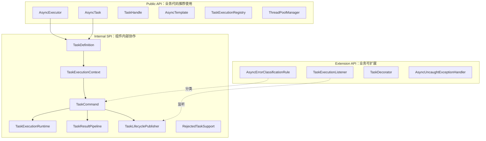

# API_GUIDE：接口使用与分层说明

## 本文适合谁看

适合业务开发、组件维护者，以及想知道“哪些接口能用，哪些接口只是内部实现”的人。

## 读完你会知道什么

- Public API、Extension API、Internal SPI 的区别。
- `AsyncExecutor` 每个方法怎么用。
- `AsyncTask` 每个参数什么意思。
- `AsyncTemplate` 每个编排方法怎么选。
- 哪些类业务代码不应该直接调用。

## 目录

- [1. API 分层总览](#1-api-分层总览)
- [2. Public API](#2-public-api)
- [3. Extension API](#3-extension-api)
- [4. Internal SPI](#4-internal-spi)
- [5. AsyncExecutor](#5-asyncexecutor)
- [6. AsyncTask](#6-asynctask)
- [7. TaskHandle](#7-taskhandle)
- [8. AsyncTemplate](#8-asynctemplate)
- [9. TaskExecutionRegistry](#9-taskexecutionregistry)
- [10. ThreadPoolManager](#10-threadpoolmanager)
- [11. 接口选择建议](#11-接口选择建议)

## 1. API 分层总览



核心原则：

```text
业务代码只依赖 Public API。
业务需要扩展时，实现 Extension API。
Internal SPI 只用于理解组件，不建议业务直接调用。
```

## 2. Public API

| API | 作用 | 业务是否直接使用 |
|---|---|---|
| `AsyncExecutor` | 提交异步任务 | 是 |
| `AsyncTask` | 描述任务 | 是 |
| `TaskHandle` | 取消和获取 Future | 是 |
| `TaskCancelResult` | 取消结果 | 是 |
| `AsyncTemplate` | 编排多个 Future | 是 |
| `TaskExecutionRegistry` | 查询任务快照 | 是，通常用于管理接口或排障 |
| `ThreadPoolManager` | 查询和调整线程池 | 是，通常用于管理接口 |

## 3. Extension API

| API | 作用 | 使用方式 |
|---|---|---|
| `TaskExecutionListener` | 监听任务生命周期 | 业务实现 Bean |
| `AsyncErrorClassificationRule` | 自定义错误分类 | 业务实现 Bean |
| `TaskDecorator` | 上下文传播 | 业务按需实现或使用默认实现 |
| `AsyncUncaughtExceptionHandler` | fire-and-forget 异常处理 | 业务可替换 |

## 4. Internal SPI

| 类 | 作用 | 为什么业务不该用 |
|---|---|---|
| `TaskDefinition` | 提交时不可变任务快照 | 由组件从 AsyncTask 自动生成 |
| `TaskExecutionContext` | 单次任务上下文 | 内部串联 Runtime、Future、Task |
| `TaskExecutionRuntime` | 状态机与线程记录 | 业务不应直接改状态 |
| `TaskCommand` | 真正提交给线程池的 Runnable | 内部封装状态、错误、事件 |
| `TaskResultPipeline` | timeout + fallback 管道 | 业务通过 AsyncTask 配置，不直接调用 |
| `RejectedTaskSupport` | 拒绝策略辅助类 | 内部收口 REJECTED 状态 |
| `ShutdownAbortAware` | shutdownNow pending 任务收口协议 | 内部生命周期协议 |
| `CallerRunsAware` | CALLER_RUNS 执行模式标记协议 | 内部拒绝策略协议 |

## 5. AsyncExecutor

### 5.1 `execute`

```java
void execute(String executorName, String taskName, Runnable runnable);
```

适用：不关心返回值、不关心 Future。

```java
asyncExecutor.execute(
        "default",
        "sendAuditLog",
        () -> auditService.send(log)
);
```

异常说明：

- 如果触发 `ABORT`，提交方可能收到拒绝异常。
- fire-and-forget 内部执行异常会交给 `AsyncUncaughtExceptionHandler`。

### 5.2 `tryExecute`

```java
boolean tryExecute(String executorName, String taskName, Runnable runnable);
```

适用：不想因为拒绝抛异常，希望用 boolean 判断是否提交成功。

```java
boolean accepted = asyncExecutor.tryExecute(
        "default",
        "sendLog",
        () -> logService.send(log)
);

if (!accepted) {
    log.warn("send log task rejected");
}
```

### 5.3 `run`

```java
CompletableFuture<Void> run(String executorName, String taskName, Runnable runnable);
```

适用：无返回值，但关心完成状态。

```java
CompletableFuture<Void> future = asyncExecutor.run(
        "default",
        "syncTag",
        () -> tagService.sync(userId)
);
```

### 5.4 `supply`

```java
<T> CompletableFuture<T> supply(String executorName, String taskName, Supplier<T> supplier);
```

适用：简单有返回值任务。

```java
CompletableFuture<UserDTO> future = asyncExecutor.supply(
        "default",
        "queryUser",
        () -> userService.query(userId)
);
```

### 5.5 `submit`

```java
<T> CompletableFuture<T> submit(AsyncTask<T> task);
```

适用：需要配置 taskId、bizKey、timeout、fallback 等完整能力。

```java
CompletableFuture<UserDTO> future = asyncExecutor.submit(
        AsyncTask.of(
                "default",
                "queryUser",
                () -> userService.query(userId)
        ).timeout(Duration.ofSeconds(2))
);
```

### 5.6 `submitHandle`

```java
<T> TaskHandle<T> submitHandle(AsyncTask<T> task);
```

适用：需要取消任务。

```java
TaskHandle<String> handle = asyncExecutor.submitHandle(task);
handle.cancel(true);
```

### 5.7 `cancel`

```java
TaskCancelResult cancel(String taskId, boolean mayInterruptIfRunning);
```

适用：根据 taskId 取消当前 JVM 中还在运行或排队的任务。

```java
TaskCancelResult result = asyncExecutor.cancel("task-10001", true);
```

## 6. AsyncTask

创建任务：

```java
AsyncTask.of("default", "queryUser", () -> userService.query(userId));
```

常用链式方法：

| 方法 | 说明 |
|---|---|
| `taskId(String)` | 指定任务 ID |
| `bizKey(String)` | 指定业务键 |
| `description(String)` | 任务描述 |
| `tag(String, String)` | 增加标签 |
| `timeout(Duration)` | 结果超时 |
| `queueTimeout(Duration)` | 排队超时 |
| `cancelOnTimeout(boolean)` | 超时后是否取消底层任务 |
| `interruptOnTimeout(boolean)` | 超时取消时是否中断线程 |
| `fallback(Function<Throwable,T>)` | 失败恢复逻辑 |
| `contextPropagation(boolean)` | 是否传播上下文 |

## 7. TaskHandle

```java
public interface TaskHandle<T> {
    String getTaskId();
    CompletableFuture<T> getFuture();
    TaskCancelResult cancel(boolean mayInterruptIfRunning);
}
```

推荐：

```java
TaskHandle<T> handle = asyncExecutor.submitHandle(task);
CompletableFuture<T> future = handle.getFuture();
TaskCancelResult result = handle.cancel(true);
```

不推荐直接只使用：

```java
future.cancel(true);
```

因为直接取消 Future 不一定能同步更新组件内部状态、注册表、监听器和指标。

## 8. AsyncTemplate

`AsyncTemplate` 用于编排多个 `CompletableFuture`，它不是任务提交入口。

| 方法 | 说明 |
|---|---|
| `allOf` | 所有 Future 成功后返回结果列表，任一失败则失败 |
| `allOfOutcome` | 所有 Future 都完成，返回每个 Future 的成功/失败结果 |
| `allOfFailFast` | 任一失败尽快失败 |
| `anyOf` | 任一 Future 完成就返回，不区分成功失败 |
| `anySuccess` | 任一 Future 成功就返回，全部失败才失败 |
| `withTimeout` | 返回带超时的包装 Future，不修改原始 Future |
| `withFallback` | 对失败 Future 增加 fallback |

### 8.1 allOf

适合全部成功才算成功：

```java
CompletableFuture<List<UserDTO>> future = asyncTemplate.allOf(
        List.of(userFuture1, userFuture2, userFuture3)
);
```

### 8.2 allOfOutcome

适合批量任务允许部分失败：

```java
CompletableFuture<List<AsyncOutcome<UserDTO>>> future =
        asyncTemplate.allOfOutcome(futures);
```

### 8.3 anySuccess

适合多个数据源兜底：

```java
CompletableFuture<UserDTO> future = asyncTemplate.anySuccess(
        List.of(primaryFuture, backupFuture)
);
```

## 9. TaskExecutionRegistry

查询单个任务：

```java
TaskExecutionSnapshot snapshot = registry.get(taskId);
```

查询最近任务：

```java
List<TaskExecutionSnapshot> recent = registry.recent(100);
```

使用场景：

```text
管理接口展示最近任务
排查某个 taskId 的最终状态
查看失败原因、耗时、执行模式
```

## 10. ThreadPoolManager

常见能力：

```text
查询线程池配置
查询线程池当前指标
动态调整 corePoolSize / maxPoolSize / queueCapacity 等部分参数
```

使用场景：

```text
管理后台
运维接口
压测时观察线程池状态
```

## 11. 接口选择建议

| 场景 | 推荐 API |
|---|---|
| 简单异步日志 | `execute` |
| 无返回值但要知道成功失败 | `run` |
| 简单有返回值 | `supply` |
| 需要超时、fallback、bizKey | `submit(AsyncTask)` |
| 需要取消 | `submitHandle(AsyncTask)` |
| 多 Future 编排 | `AsyncTemplate` |
| 自定义错误分类 | `AsyncErrorClassificationRule` |
| 监听任务完成 | `TaskExecutionListener` |
| 查询任务状态 | `TaskExecutionRegistry` |
| 查询线程池 | `ThreadPoolManager` |
