# FLOW_AND_STATE：状态机与时序图

## 本文适合谁看

适合想理解任务从提交到完成全过程的人，包括业务开发、组件维护者和排障人员。

## 读完你会知道什么

- 任务有哪些状态。
- 哪些状态转换是合法的。
- 成功、失败、超时、fallback、拒绝、取消、shutdown 如何流转。
- `CALLER_RUNS` 为什么不是 `REJECTED`。
- `FALLBACK_SUCCESS` 为什么不是简单的 `SUCCESS`。

## 目录

- [1. 状态总览](#1-状态总览)
- [2. 状态机总图](#2-状态机总图)
- [3. 正常成功](#3-正常成功)
- [4. 原始任务失败，无 fallback](#4-原始任务失败无-fallback)
- [5. 原始任务失败，fallback 成功](#5-原始任务失败fallback-成功)
- [6. 原始任务失败，fallback 失败](#6-原始任务失败fallback-失败)
- [7. 结果层超时](#7-结果层超时)
- [8. 线程池拒绝](#8-线程池拒绝)
- [9. CALLER_RUNS](#9-caller_runs)
- [10. 主动取消](#10-主动取消)
- [11. shutdown 场景](#11-shutdown-场景)
- [12. 状态转换禁止规则](#12-状态转换禁止规则)

## 1. 状态总览

| 状态 | 含义 | 是否终态 |
|---|---|---|
| `CREATED` | 任务对象已创建，但还未提交 | 否 |
| `SUBMITTED` | 已提交到组件，准备进入线程池 | 否 |
| `RUNNING` | 原始任务正在执行 | 否 |
| `SUCCESS` | 原始任务成功 | 是 |
| `FAILED` | 原始任务失败 | 可进入 fallback |
| `TIMEOUT` | 结果层或排队超时 | 可进入 fallback |
| `REJECTED` | 线程池拒绝任务 | 可进入 fallback |
| `FALLBACK` | fallback 正在被触发 | 否 |
| `FALLBACK_SUCCESS` | fallback 成功，最终 Future 正常完成 | 是 |
| `FALLBACK_FAILED` | fallback 失败，最终 Future 异常完成 | 是 |
| `CANCELLED` | 任务被取消 | 是 |

## 2. 状态机总图

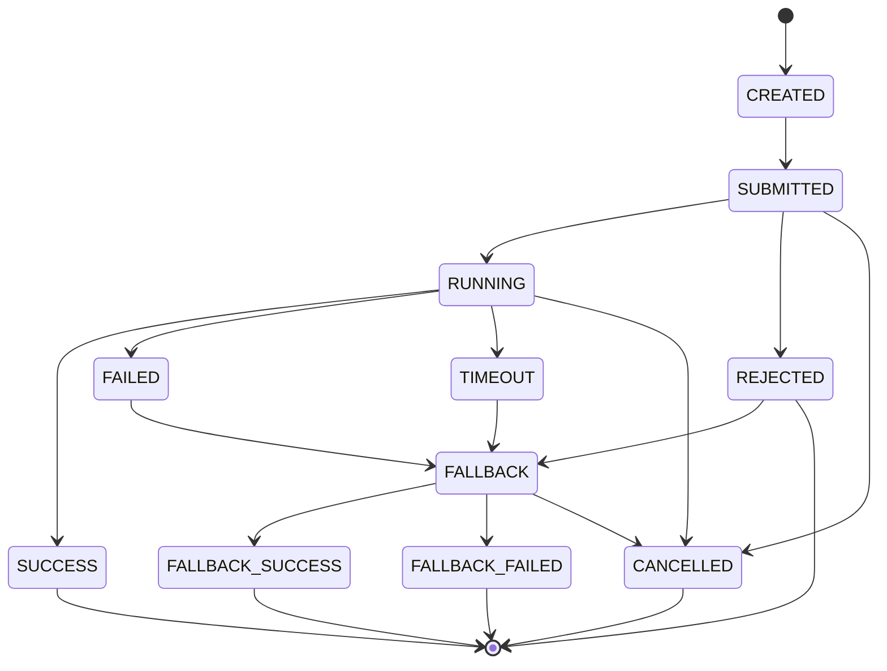

## 3. 正常成功

### 状态图

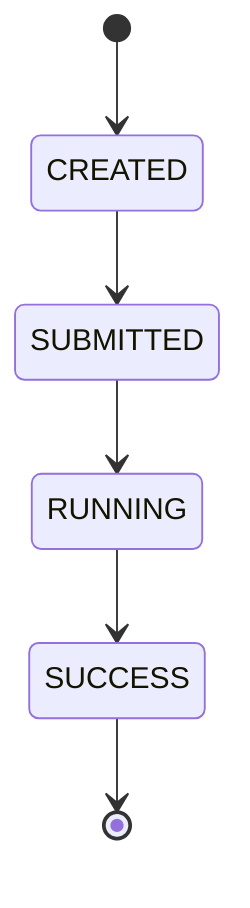

### 时序图

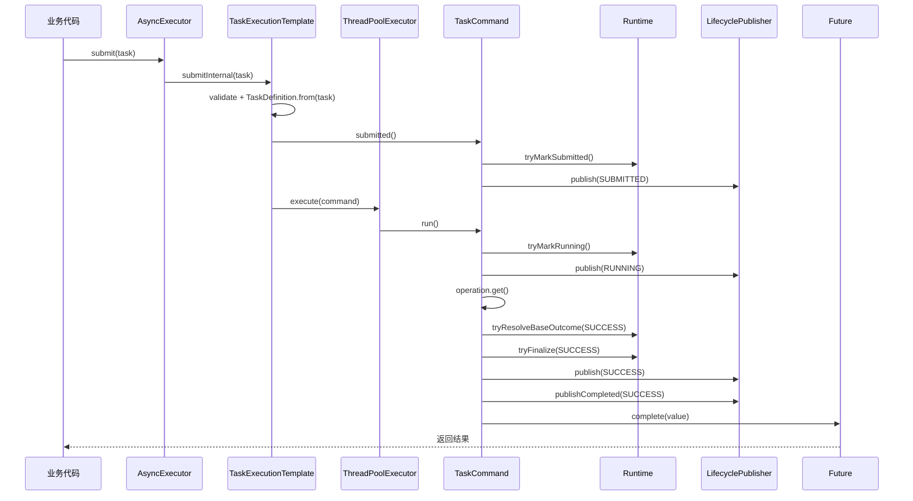

## 4. 原始任务失败，无 fallback

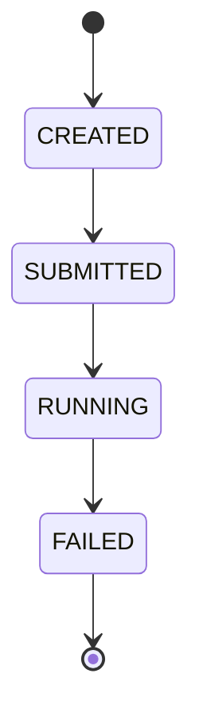

说明：

```text
原始 operation 抛异常。
TaskCommand 分类错误，发布 FAILED。
没有 fallback 时，最终 Future 异常完成。
```

## 5. 原始任务失败，fallback 成功

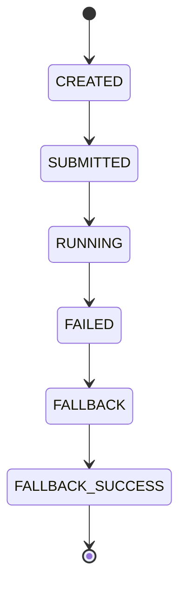

时序：

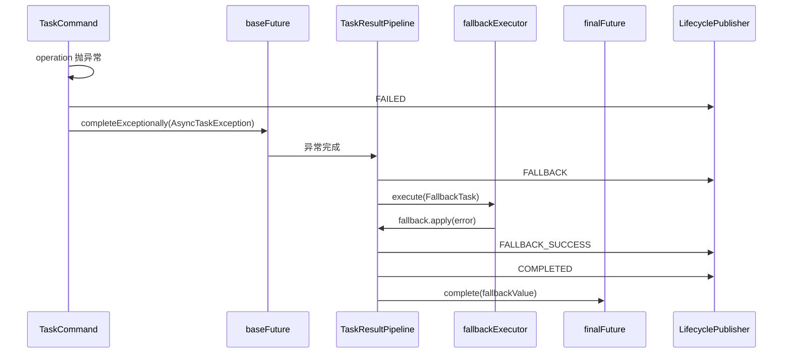

关键点：

```text
FAILED 表示原始任务失败。
FALLBACK_SUCCESS 表示最终结果被 fallback 恢复。
两者不冲突，因为它们描述的是不同阶段。
```

## 6. 原始任务失败，fallback 失败

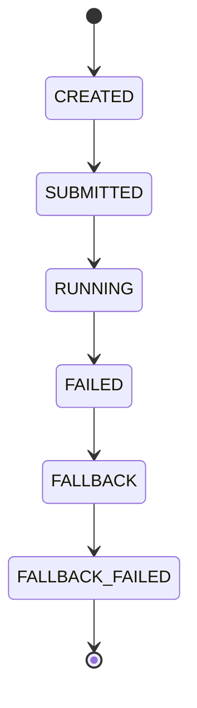

最终 Future 异常完成，异常通常是 fallback 阶段的 `AsyncTaskException`。

## 7. 结果层超时

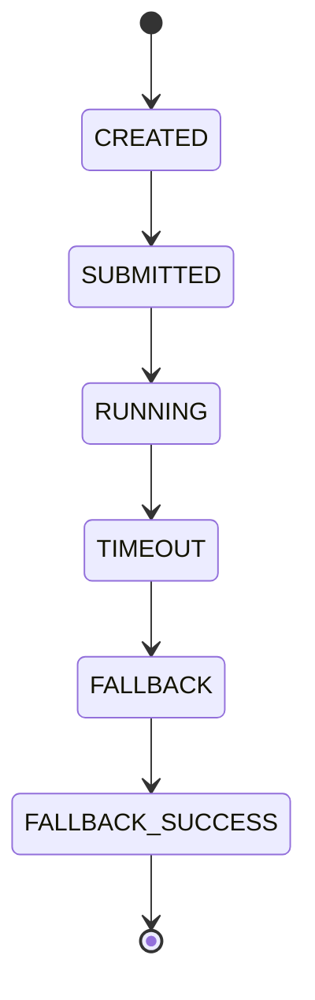

时序：

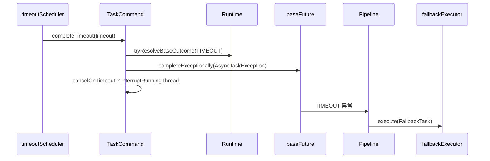

注意：

```text
timeout 后可能尝试 interrupt，但 interrupt 不是强杀。
真实业务代码仍然要配置 RPC/DB/HTTP 自身超时。
```

## 8. 线程池拒绝

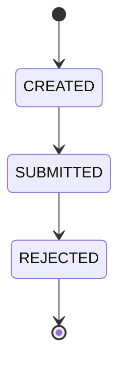

如果配置了 fallback：

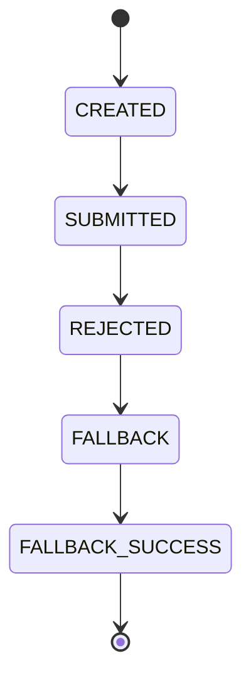

## 9. CALLER_RUNS

`CALLER_RUNS` 是一种执行模式，不是失败状态。

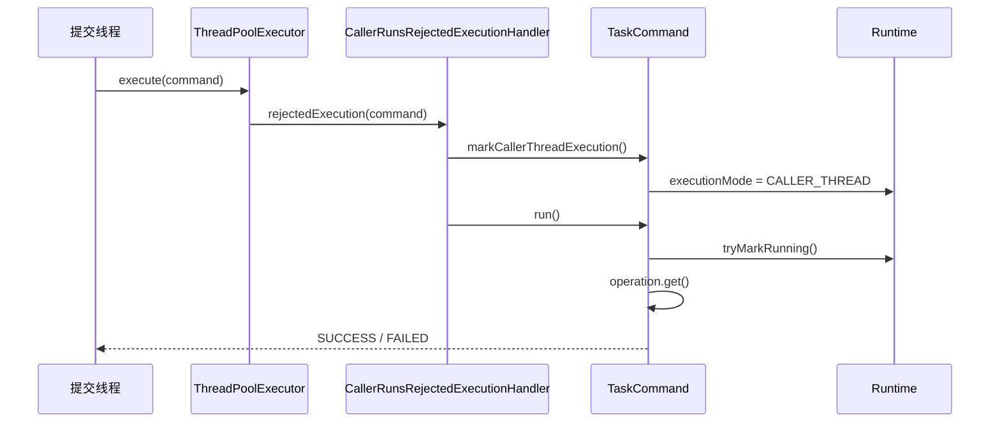

最终可能是：

```text
status = SUCCESS
executionMode = CALLER_THREAD
```

不是：

```text
status = REJECTED
```

## 10. 主动取消

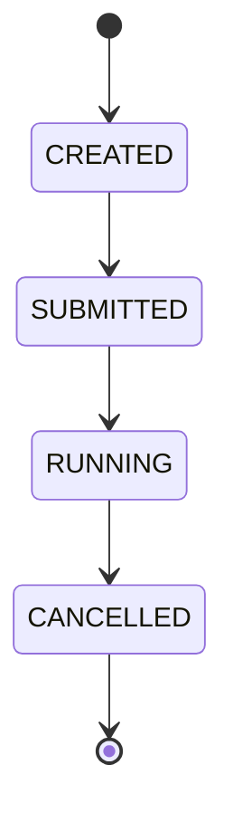

时序：

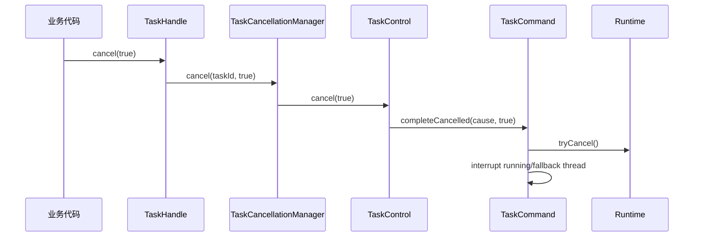

## 11. shutdown 场景

### 11.1 业务线程池 pending 任务

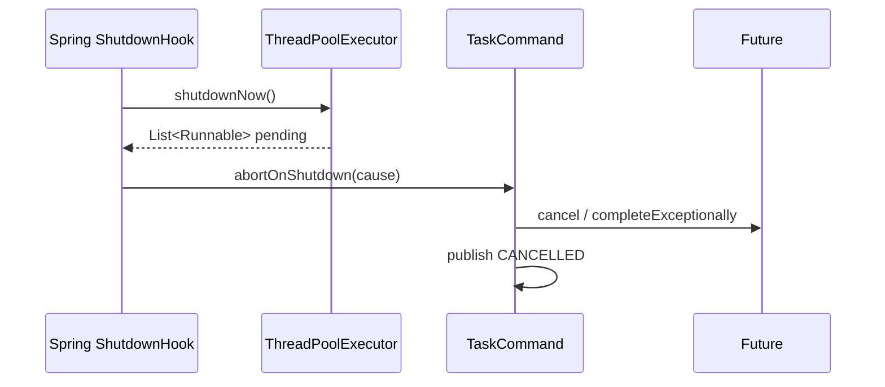

### 11.2 fallbackExecutor pending fallback

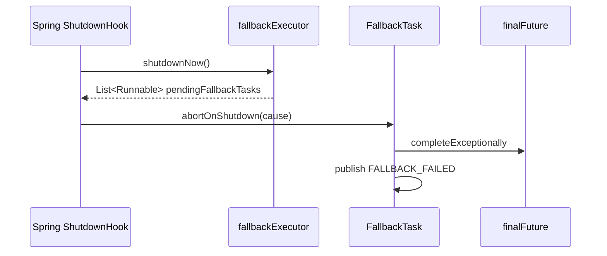

## 12. 状态转换禁止规则

不允许：

```text
CANCELLED → SUBMITTED
REJECTED → RUNNING
TIMEOUT → RUNNING
SUCCESS → CANCELLED
FALLBACK_SUCCESS → FAILED
FALLBACK_FAILED → SUCCESS
```

这些规则由 `TaskExecutionRuntime` 的语义化方法保证，而不是靠业务代码自觉。
