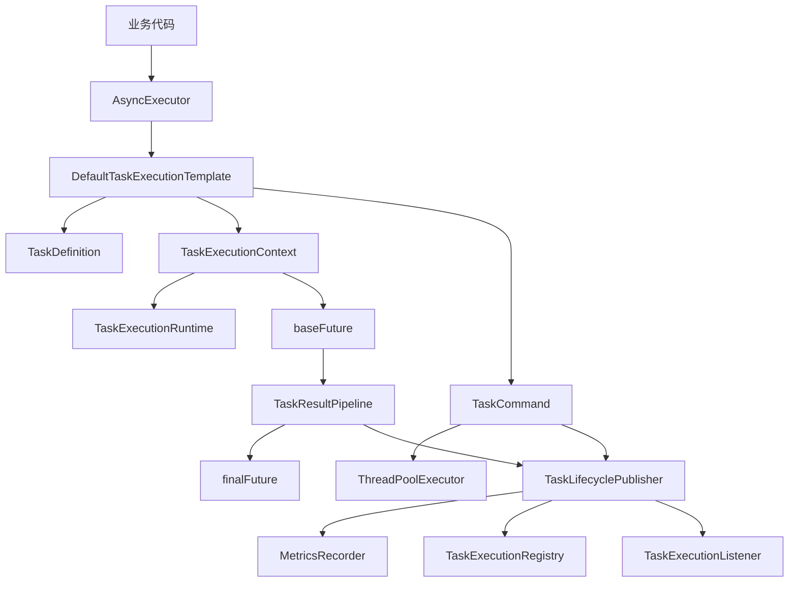
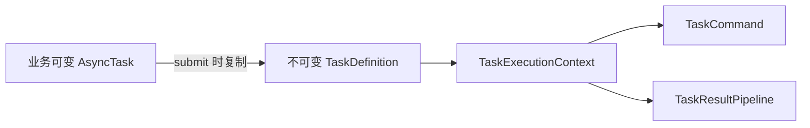
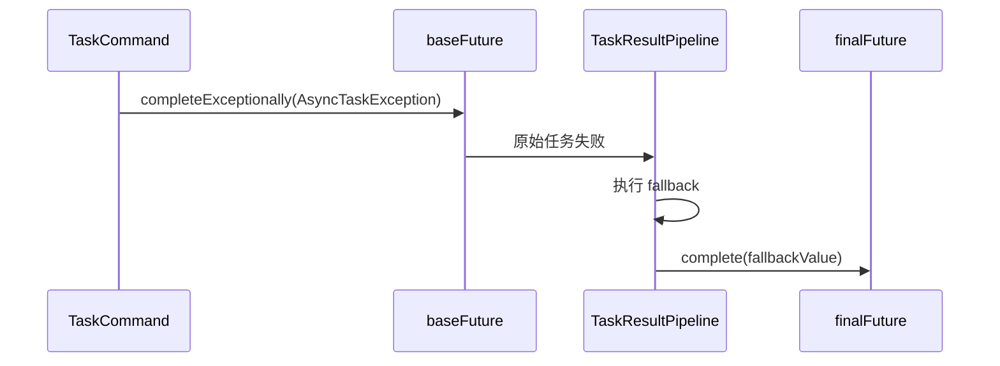
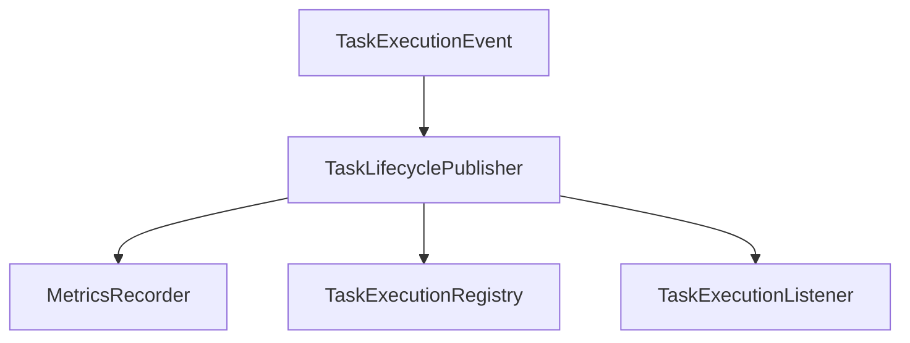

# INTERNAL_DESIGN：组件内部设计

## 本文适合谁看

适合组件维护者、希望吃透并行组件内部设计的人。

业务使用者可以先阅读 `USER_GUIDE.md`，不需要一开始理解本文全部内容。

## 读完你会知道什么

- 为什么要设计 `TaskDefinition`。
- 为什么区分 `baseFuture` 和 `finalFuture`。
- `TaskCommand`、`TaskExecutionRuntime`、`TaskResultPipeline` 如何协作。
- 生命周期事件如何发布。
- 拒绝、超时、fallback、取消如何收口。

## 目录

- [1. 总体架构](#1-总体架构)
- [2. 核心对象职责](#2-核心对象职责)
- [3. 为什么需要 TaskDefinition](#3-为什么需要-taskdefinition)
- [4. 为什么区分 baseFuture 和 finalFuture](#4-为什么区分-basefuture-和-finalfuture)
- [5. TaskCommand 的职责](#5-taskcommand-的职责)
- [6. TaskExecutionRuntime 的职责](#6-taskexecutionruntime-的职责)
- [7. TaskResultPipeline 的职责](#7-taskresultpipeline-的职责)
- [8. TaskLifecyclePublisher 的职责](#8-tasklifecyclepublisher-的职责)
- [9. 内部协作接口](#9-内部协作接口)
- [10. 设计边界](#10-设计边界)

## 1. 总体架构



一个任务进入组件后，大致经过：

```text
AsyncTask
  → validate
  → TaskDefinition 快照
  → TaskExecutionContext
  → TaskCommand
  → ThreadPoolExecutor
  → baseFuture
  → TaskResultPipeline
  → finalFuture
```

## 2. 核心对象职责

| 对象 | 职责 |
|---|---|
| `AsyncTask` | 用户提交任务时使用的可变任务描述 |
| `TaskDefinition` | 提交时生成的不可变任务快照 |
| `TaskExecutionContext` | 单次任务上下文，聚合 Definition、Runtime、Future |
| `TaskExecutionRuntime` | 状态机、时间、执行线程、执行模式 |
| `TaskCommand` | 真正提交给线程池的 Runnable |
| `TaskResultPipeline` | 对 baseFuture 应用 timeout 和 fallback |
| `TaskLifecyclePublisher` | 发布事件、记录指标、更新注册表、通知监听器 |
| `TaskControl` | 支持取消任务 |
| `TaskControlRegistry` | 根据 taskId 找到可取消任务 |

## 3. 为什么需要 TaskDefinition

`AsyncTask` 是业务创建的对象，它是可变的：

```java
AsyncTask<String> task = AsyncTask.of("default", "query", () -> query());
task.timeout(Duration.ofSeconds(2));
task.fallback(error -> "fallback");
```

如果提交后继续修改：

```java
CompletableFuture<String> future = asyncExecutor.submit(task);
task.fallback(error -> "another fallback");
```

如果内部一直读取 `AsyncTask`，那么任务执行时到底使用哪个 fallback 会变得不确定。

所以提交时生成：

```java
TaskDefinition<T> definition = TaskDefinition.from(task);
```

`TaskDefinition` 是一次执行的固定快照，后续主链路只读取它。



## 4. 为什么区分 baseFuture 和 finalFuture

```text
baseFuture：原始任务的执行结果。
finalFuture：对原始结果应用 timeout、fallback 后返回给业务的最终结果。
```

例如原任务失败但 fallback 成功：

```text
baseFuture = 异常完成，表示原始任务 FAILED
finalFuture = 正常完成，返回 fallbackValue
最终状态 = FALLBACK_SUCCESS
```



如果没有区分两者，就无法同时表达：

```text
原始任务失败了
最终业务结果通过 fallback 恢复了
```

## 5. TaskCommand 的职责

`TaskCommand` 是真正提交给 `ThreadPoolExecutor` 的 `Runnable`。

职责：

```text
1. 发布 SUBMITTED / RUNNING / SUCCESS / FAILED / TIMEOUT / REJECTED / CANCELLED。
2. 执行业务 operation。
3. 完成 baseFuture。
4. 调用 AsyncErrorClassifier 生成 AsyncError。
5. 响应拒绝策略 RejectedTaskAware。
6. 响应 CALLER_RUNS CallerRunsAware。
7. 响应 shutdownNow ShutdownAbortAware。
```

业务代码不应该直接创建 `TaskCommand`。

## 6. TaskExecutionRuntime 的职责

`TaskExecutionRuntime` 只负责运行时状态，不负责发布事件。

它保存：

```text
status
resultMode
executionMode
submitTime
startTime
endTime
runningThread
fallbackThread
baseOutcomeResolved
finalOutcomeResolved
```

它提供语义化状态方法：

```text
tryMarkSubmitted
tryMarkRunning
tryResolveBaseOutcome
tryMarkFallback
tryFinalize
tryCancel
```

状态变化必须通过这些方法完成，避免：

```text
CANCELLED → SUBMITTED
TIMEOUT → RUNNING
SUCCESS → FAILED
```

## 7. TaskResultPipeline 的职责

`TaskResultPipeline` 不执行原始任务，只处理结果。

```text
baseFuture
  → applyTimeout
  → applyFallback
  → finalFuture
```

它负责：

```text
1. 结果层 timeout。
2. timeout 后调用 TaskCommand.completeTimeout。
3. timeout 后根据配置 cancel / interrupt。
4. 失败、超时、拒绝后触发 fallback。
5. fallback 成功发布 FALLBACK_SUCCESS。
6. fallback 失败发布 FALLBACK_FAILED。
7. fallbackExecutor shutdown 时收口 pending fallback。
```

## 8. TaskLifecyclePublisher 的职责

`TaskLifecyclePublisher` 是旁路发布器。



职责：

```text
publish(event)：发布具体状态事件。
publishCompleted(event)：发布完成通知，但不重复更新 Registry。
```

监听器异常不能影响主任务。

## 9. 内部协作接口

### 9.1 RejectedTaskAware

拒绝策略通知任务被拒绝。

```text
RejectedExecutionHandler
  → RejectedTaskSupport.reject
  → TaskCommand.reject
  → REJECTED
```

### 9.2 CallerRunsAware

CALLER_RUNS 策略在调用线程执行任务前，通知任务标记：

```text
executionMode = CALLER_THREAD
```

### 9.3 ShutdownAbortAware

`shutdownNow()` 返回的 pending 任务不会再执行，需要通知它收口：

```text
业务线程池 pending TaskCommand → CANCELLED
fallbackExecutor pending FallbackTask → FALLBACK_FAILED
```

## 10. 设计边界

当前一期是本地 JVM 并行组件，不负责：

```text
跨 JVM 分布式取消
跨 JVM 任务路由
分布式锁
分布式任务调度
复杂重试补偿状态机
```

这些可以在二期或独立组件中设计。
