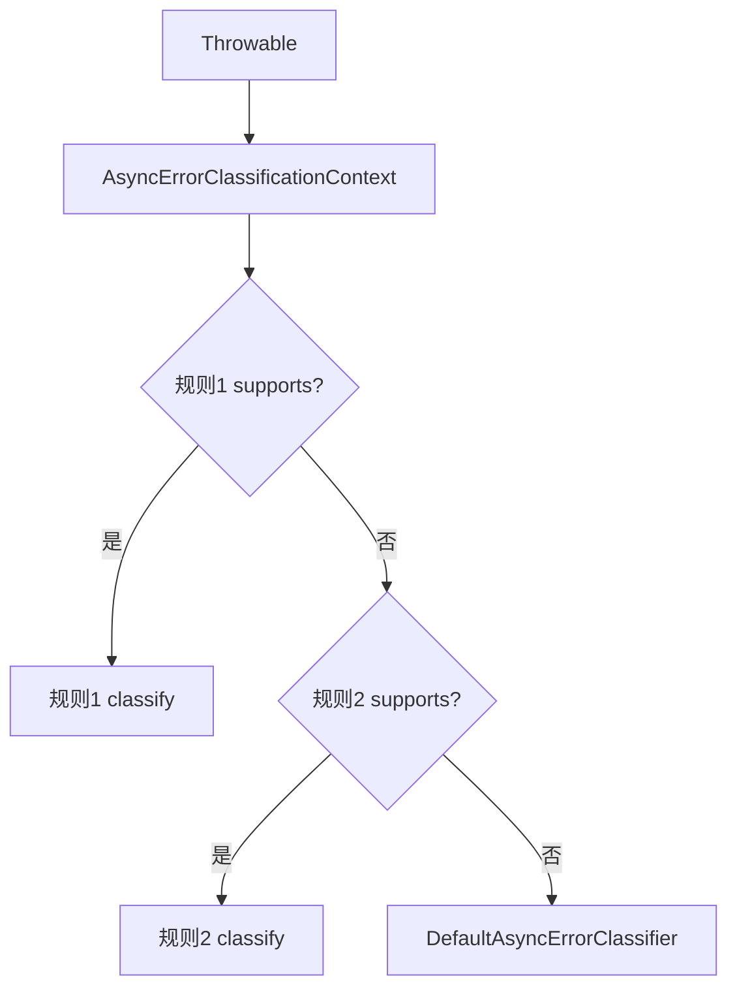

# OBSERVABILITY_AND_ERROR：错误分类、监听器、指标与任务注册表

## 本文适合谁看

适合需要排查任务失败原因、接入监控指标、扩展错误分类和监听任务事件的人。

## 读完你会知道什么

- `AsyncError` 为什么比普通 Throwable 更适合排障。
- 如何自定义错误分类规则。
- `TaskExecutionListener` 每个事件什么时候触发。
- `TaskExecutionRegistry` 保存什么。
- 指标应该怎么看。
- 监听器和分类规则异常为什么不能影响主链路。

## 目录

- [1. AsyncError 错误模型](#1-asyncerror-错误模型)
- [2. AsyncErrorClassifier](#2-asyncerrorclassifier)
- [3. 自定义错误分类规则](#3-自定义错误分类规则)
- [4. TaskExecutionListener](#4-taskexecutionlistener)
- [5. TaskExecutionRegistry](#5-taskexecutionregistry)
- [6. Micrometer 指标](#6-micrometer-指标)
- [7. 内部诊断建议](#7-内部诊断建议)
- [8. 排障流程](#8-排障流程)

## 1. AsyncError 错误模型

普通异常只能看到：

```text
RuntimeException: RPC failed
```

但排障时更需要知道：

```text
这是业务异常还是系统异常？
发生在哪个阶段？
是否可重试？
是否需要补偿？
对应哪个 taskId？
是否有远程服务名、错误码、业务场景？
```

所以组件定义 `AsyncError`，结构化保存：

```text
classification
application
remote
exception
recovery
attributes
```

## 2. AsyncErrorClassifier

现在错误分类器接收的是：

```java
AsyncErrorClassificationContext
```

上下文中包含：

```text
TaskMetadata task
Throwable throwable
Throwable unwrapped
Throwable rootCause
AsyncErrorStage stage
```

为什么不传 `AsyncTask`？

```text
AsyncTask 是业务创建的可变对象。
提交后组件内部使用 TaskDefinition / TaskMetadata 快照。
错误分类只需要稳定的任务元数据，不应该依赖可变 AsyncTask。
```

## 3. 自定义错误分类规则

```java
@Component
public class DomainErrorRule implements AsyncErrorClassificationRule {

    @Override
    public boolean supports(AsyncErrorClassificationContext context) {
        return context.getRootCause() instanceof DomainException;
    }

    @Override
    public AsyncError classify(AsyncErrorClassificationContext context) {
        DomainException ex = (DomainException) context.getRootCause();

        return AsyncError.builder()
                .classification(AsyncErrorClassification.of(
                        AsyncErrorCategory.APPLICATION,
                        AsyncErrorReason.TASK_THROWN,
                        context.getStage()
                ))
                .application(ApplicationErrorInfo.of(
                        ex.getErrorCode(),
                        ex.getSceneCode(),
                        ex.getMessage()
                ))
                .exception(ExceptionInfo.from(context.getThrowable()))
                .recovery(RecoveryHint.of(
                        AsyncRecoveryAction.COMPENSATE,
                        false,
                        true,
                        true
                ))
                .build();
    }

    @Override
    public int order() {
        return -100;
    }
}
```

规则链：



## 4. TaskExecutionListener

生命周期事件：

| 方法 | 触发时机 |
|---|---|
| `onSubmitted` | 任务提交到组件 |
| `onStarted` | 原始任务开始运行 |
| `onSuccess` | 原始任务成功 |
| `onFailure` | 原始任务失败 |
| `onTimeout` | 原始任务超时 |
| `onRejected` | 线程池拒绝 |
| `onCancelled` | 任务取消 |
| `onFallback` | fallback 被触发 |
| `onFallbackSuccess` | fallback 成功 |
| `onFallbackFailure` | fallback 失败 |
| `onCompleted` | 最终完成通知 |

示例：

```java
@Component
public class AuditTaskListener implements TaskExecutionListener {

    @Override
    public void onCompleted(TaskExecutionEvent event) {
        auditService.record(
                event.getTaskId(),
                event.getTaskName(),
                event.getStatus(),
                event.getTotalCostMillis()
        );
    }
}
```

监听器原则：

```text
监听器是旁路能力。
监听器异常不能影响主任务结果。
监听器不要执行重逻辑，重逻辑建议投递 MQ 或写轻量事件。
```

## 5. TaskExecutionRegistry

注册表保存任务快照：

```text
task metadata
status
executionMode
resultMode
timing
error
updatedAtMillis
```

查询：

```java
TaskExecutionSnapshot snapshot = registry.get(taskId);
List<TaskExecutionSnapshot> recent = registry.recent(100);
```

Registry 是本地内存注册表，不是分布式任务数据库。

## 6. Micrometer 指标

建议关注：

| 指标 | 含义 |
|---|---|
| task.submitted | 提交数 |
| task.started | 开始数 |
| task.success | 成功数 |
| task.failed | 失败数 |
| task.timeout | 超时数 |
| task.rejected | 拒绝数 |
| task.cancelled | 取消数 |
| task.fallback.success | fallback 成功数 |
| task.fallback.failure | fallback 失败数 |
| task.caller.runs | CALLER_RUNS 次数 |
| queue.size | 队列大小 |
| active.count | 活跃线程数 |
| queue.usage.ratio | 队列使用率 |

注意：

```text
Micrometer tag 不要放 taskId、bizKey 这种高基数字段。
日志可以放 taskId。
指标 tag 只放 executorName、taskName、status、executionMode 等低基数字段。
```

## 7. 内部诊断建议

监听器和错误分类规则异常不应该影响主链路，但不能完全静默。

建议后续提供：

```text
ConcurrencyInternalDiagnostics
```

用于记录：

```text
listener failure
classifier rule failure
internal shutdown abort failure
```

这样既不影响主任务，又能排查旁路异常。

## 8. 排障流程

当一个任务失败时：

```text
1. 根据 taskId 查询 TaskExecutionSnapshot。
2. 看 status：FAILED / TIMEOUT / REJECTED / FALLBACK_FAILED。
3. 看 executionMode：THREAD_POOL / CALLER_THREAD。
4. 看 timing：queueCost / runCost / totalCost。
5. 看 AsyncError：category / reason / stage。
6. 看是否触发 fallback。
7. 看线程池指标：队列、活跃线程、拒绝数。
8. 看业务日志中 taskId 对应上下文。
```
