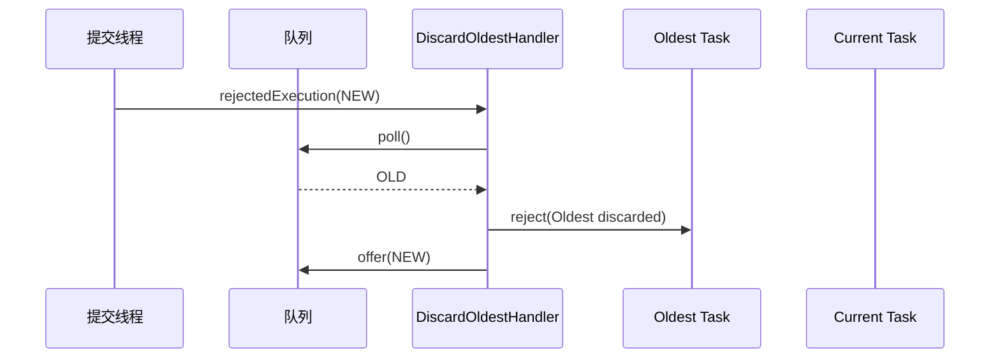

# THREAD_POOL_AND_REJECTION：线程池治理与拒绝策略

## 本文适合谁看

适合需要配置线程池、理解拒绝策略、排查线程池满了以后任务如何处理的人。

## 读完你会知道什么

- `ThreadPoolSpec` 每个参数怎么配置。
- 五种拒绝策略分别是什么语义。
- 为什么组件要做“拒绝感知”。
- 为什么 `CALLER_RUNS` 不是 `REJECTED`。
- 为什么 `DISCARD` 不能静默丢弃。
- 为什么 `shutdownNow()` 返回任务必须处理。

## 目录

- [1. 线程池配置模型](#1-线程池配置模型)
- [2. 队列类型](#2-队列类型)
- [3. 拒绝感知是什么](#3-拒绝感知是什么)
- [4. ABORT](#4-abort)
- [5. CALLER_RUNS](#5-caller_runs)
- [6. DISCARD](#6-discard)
- [7. DISCARD_OLDEST](#7-discard_oldest)
- [8. BLOCKING_WAIT](#8-blocking_wait)
- [9. shutdown 二次检查](#9-shutdown-二次检查)
- [10. shutdownNow 返回任务处理](#10-shutdownnow-返回任务处理)
- [11. 配置建议](#11-配置建议)

## 1. 线程池配置模型

```yaml
xjtu:
  iron:
    concurrency:
      thread-pools:
        biz-query-pool:
          core-pool-size: 8
          max-pool-size: 16
          queue-capacity: 500
          keep-alive-time: 60s
          thread-name-prefix: biz-query-
          queue-type: BOUNDED_ARRAY_BLOCKING_QUEUE
          rejection-policy: ABORT
          wait-for-tasks-to-complete-on-shutdown: true
          await-termination: 10s
```

核心参数：

| 参数 | 说明 |
|---|---|
| `core-pool-size` | 核心线程数 |
| `max-pool-size` | 最大线程数 |
| `queue-capacity` | 队列容量 |
| `keep-alive-time` | 非核心线程空闲保留时间 |
| `queue-type` | 队列类型 |
| `rejection-policy` | 拒绝策略 |
| `wait-for-tasks-to-complete-on-shutdown` | 关闭时是否等待任务完成 |
| `await-termination` | 优雅关闭等待时间 |

## 2. 队列类型

| 队列类型 | 说明 | 适用场景 |
|---|---|---|
| `BOUNDED_ARRAY_BLOCKING_QUEUE` | 有界数组队列 | 推荐默认使用 |
| `BOUNDED_LINKED_BLOCKING_QUEUE` | 有界链表队列 | 需要较大队列时 |
| `DIRECT_HANDOFF` | 不存储任务，直接交给线程 | 低延迟、强反压场景 |

有界队列的 `queueCapacity` 必须大于 0。

`DIRECT_HANDOFF` 通常使用 `SynchronousQueue`，不依赖 queueCapacity。

## 3. 拒绝感知是什么

JDK 原生拒绝策略只知道 `Runnable`，不知道组件里的：

```text
taskId
CompletableFuture
TaskExecutionRegistry
TaskExecutionListener
Metrics
```

如果任务被静默丢弃，业务 Future 可能永远不完成。

所以组件定义了内部协议：

```text
RejectedTaskAware
```

`TaskCommand` 实现它。

拒绝策略通过：

```text
RejectedTaskSupport.reject(command, reason)
```

通知任务进入：

```text
REJECTED
```

并完成 Future、更新状态、记录指标、通知监听器。

## 4. ABORT

语义：

```text
当前任务不执行。
任务状态变为 REJECTED。
Future 异常完成。
提交线程同步收到 RejectedExecutionException。
```

适合默认生产策略。

## 5. CALLER_RUNS

语义：

```text
线程池运行中但已满：提交线程直接执行任务。
线程池已经 shutdown：任务明确 REJECTED。
```

为什么 shutdown 后不继续由提交线程执行？

```text
shutdown 表示线程池已经不再接受新任务。
如果关闭后还继续执行新任务，会破坏线程池生命周期语义。
```

CALLER_RUNS 成功任务最终可能是：

```text
status = SUCCESS
executionMode = CALLER_THREAD
```

不是：

```text
status = REJECTED
```

## 6. DISCARD

组件里的 DISCARD 是“拒绝感知版 DISCARD”。

语义：

```text
任务不执行。
状态变为 REJECTED。
Future 异常完成。
提交方法通常不同步抛异常。
```

它不是 JDK 原生静默丢弃。

原因：

```text
如果静默丢弃，CompletableFuture 可能永远 pending。
```

## 7. DISCARD_OLDEST

语义：

```text
移除队列中最老的任务。
通知旧任务 REJECTED。
尝试把当前任务放入队列。
```

时序：



注意：不能重新调用 `executor.execute(newTask)`，否则可能递归进入同一个拒绝策略。

## 8. BLOCKING_WAIT

语义：

```text
线程池满时，提交线程等待队列空位。
等待成功：任务入队。
等待超时：REJECTED。
等待中断：恢复中断标记并 REJECTED。
线程池关闭：REJECTED。
```

建议等待时间很短，例如：

```yaml
rejection-policy: BLOCKING_WAIT
rejection-wait-time: 50ms
```

不要配置几秒，否则会阻塞 Tomcat、RPC、MQ 消费线程。

## 9. shutdown 二次检查

自定义拒绝策略如果直接调用：

```java
queue.offer(runnable)
```

就绕过了 `ThreadPoolExecutor.execute()` 内部的入队后二次检查。

所以需要：

```java
RejectedTaskSupport.rejectIfShutdownAfterEnqueue(
        runnable,
        executor,
        "Executor shutdown after enqueue"
);
```

它解决这个竞争：

```text
检查线程池未关闭
→ 等待队列空位
→ 等待期间线程池 shutdown
→ offer 成功
→ 任务实际是在 shutdown 后入队
```

## 10. shutdownNow 返回任务处理

`shutdownNow()` 会返回队列中尚未开始执行的任务。

如果忽略返回值，这些任务：

```text
不会 run
不会 reject
不会 cancel
Future 可能永远 pending
```

所以关闭钩子必须处理：

```java
List<Runnable> pendingTasks = executor.shutdownNow();

for (Runnable runnable : pendingTasks) {
    if (runnable instanceof ShutdownAbortAware abortAware) {
        abortAware.abortOnShutdown(cause);
    }
}
```

业务线程池 pending `TaskCommand` 一般收口为：

```text
CANCELLED
```

fallbackExecutor pending `FallbackTask` 一般收口为：

```text
FALLBACK_FAILED
```

## 11. 配置建议

| 场景 | 推荐拒绝策略 |
|---|---|
| 普通业务查询 | ABORT |
| 可接受提交线程反压 | CALLER_RUNS |
| 日志类低价值任务 | DISCARD，但必须接受 Future 异常完成语义 |
| 少量队列替换场景 | DISCARD_OLDEST，谨慎使用 |
| 希望短暂等待空位 | BLOCKING_WAIT，等待时间要短 |

生产默认建议：

```text
ABORT + 明确 fallback 或上游降级
```
