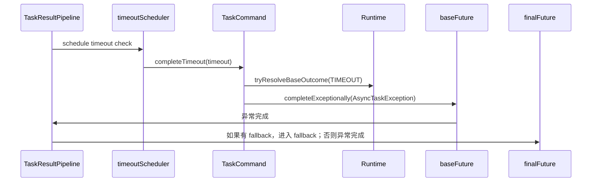
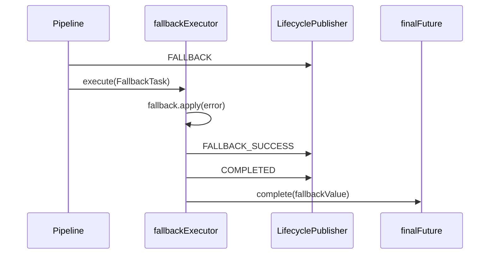
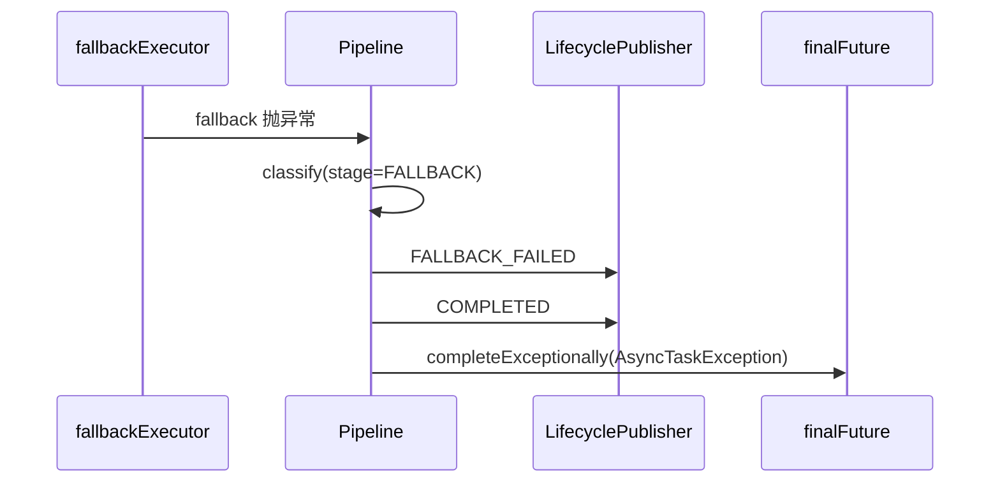
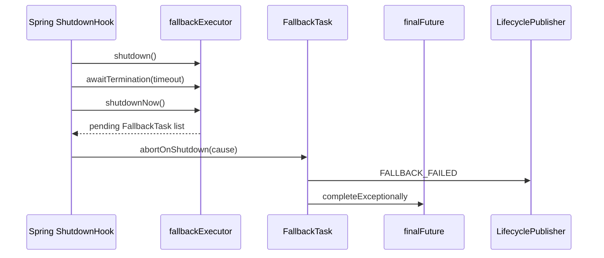

# TIMEOUT_FALLBACK_CANCEL：超时、fallback 与取消

## 本文适合谁看

适合想理解任务超时、降级、取消、fallbackExecutor 生命周期的人。

## 读完你会知道什么

- `timeout` 和 `queueTimeout` 有什么区别。
- `cancelOnTimeout` 和 `interruptOnTimeout` 怎么理解。
- fallback 什么时候触发。
- fallback 为什么需要独立线程池。
- fallbackExecutor 关闭为什么不能直接 `destroyMethod=shutdownNow`。
- 主动取消如何流转。

## 目录

- [1. timeout 与 queueTimeout](#1-timeout-与-queuetimeout)
- [2. timeout 的内部流转](#2-timeout-的内部流转)
- [3. cancelOnTimeout 与 interruptOnTimeout](#3-cancelontimeout-与-interruptontimeout)
- [4. fallback 触发条件](#4-fallback-触发条件)
- [5. fallback 成功](#5-fallback-成功)
- [6. fallback 失败](#6-fallback-失败)
- [7. fallbackExecutor 为什么独立](#7-fallbackexecutor-为什么独立)
- [8. fallbackExecutor shutdown](#8-fallbackexecutor-shutdown)
- [9. 主动取消](#9-主动取消)
- [10. 取消与 fallback 的关系](#10-取消与-fallback-的关系)

## 1. timeout 与 queueTimeout

| 参数 | 作用 | 检查时机 |
|---|---|---|
| `queueTimeout` | 任务在队列中等待太久 | 任务真正开始运行前 |
| `timeout` | 任务整体结果超时 | ResultPipeline 中由 timeoutScheduler 检查 |

### queueTimeout

```java
AsyncTask.of("default", "task", () -> call())
        .queueTimeout(Duration.ofMillis(500));
```

如果任务排队超过 500ms 才被工作线程取到，则进入 TIMEOUT。

### timeout

```java
AsyncTask.of("default", "task", () -> call())
        .timeout(Duration.ofSeconds(2));
```

如果最终结果 2 秒内没有完成，则进入 TIMEOUT。

## 2. timeout 的内部流转



## 3. cancelOnTimeout 与 interruptOnTimeout

```java
AsyncTask.of("default", "remoteCall", () -> remote.call())
        .timeout(Duration.ofSeconds(1))
        .cancelOnTimeout(true)
        .interruptOnTimeout(true);
```

含义：

```text
timeout 后，组件尝试取消底层原始任务。
如果 interruptOnTimeout=true，则尝试 interrupt 运行线程。
```

重要说明：

```text
interrupt 是协作式中断。
如果业务代码、HTTP 客户端、数据库驱动不响应中断，线程不会立刻停下。
```

所以仍然应该配置：

```text
HTTP connect timeout
HTTP read timeout
RPC timeout
DB query timeout
```

## 4. fallback 触发条件

fallback 会在这些状态后触发：

```text
FAILED
TIMEOUT
REJECTED
```

不会因为主动取消默认触发 fallback。

原因：

```text
主动取消表示调用方明确不想要结果了，组件不应该再用 fallback 把它恢复成成功。
```

## 5. fallback 成功



## 6. fallback 失败



## 7. fallbackExecutor 为什么独立

如果 fallback 直接在完成上游 Future 的线程里执行，可能会阻塞：

```text
业务工作线程
timeoutScheduler 线程
调用 completeExceptionally 的线程
```

所以组件使用独立 fallbackExecutor。

设计目标：

```text
timeoutScheduler 只做超时判断，不执行复杂 fallback。
业务线程不被 fallback 阻塞。
fallback 自己也能被监控和治理。
```

## 8. fallbackExecutor shutdown

fallbackExecutor 不能简单写：

```java
@Bean(destroyMethod = "shutdownNow")
```

因为队列里的 fallback 任务如果被 `shutdownNow()` 移出来但不处理，最终 Future 可能永远 pending。

正确做法：

```text
FallbackTask 实现 ShutdownAbortAware。
关闭钩子调用 shutdownNow() 后遍历 pending task。
pending FallbackTask 调用 abortOnShutdown。
最终收口为 FALLBACK_FAILED。
```

时序：



## 9. 主动取消

```java
TaskHandle<String> handle = asyncExecutor.submitHandle(task);
TaskCancelResult result = handle.cancel(true);
```

取消场景：

| 场景 | 处理 |
|---|---|
| 队列中 | 从队列移除，状态 CANCELLED |
| 运行中 | 标记 CANCELLED，尝试 interrupt |
| fallback 中 | 标记 CANCELLED，尝试 interrupt fallback 线程 |
| 已完成 | 返回 ALREADY_COMPLETED |
| 找不到 | 返回 NOT_FOUND |

## 10. 取消与 fallback 的关系

默认原则：

```text
主动取消不触发 fallback。
超时、失败、拒绝可以触发 fallback。
```

原因：

```text
fallback 是失败恢复。
cancel 是调用方主动终止。
二者语义不同。
```
