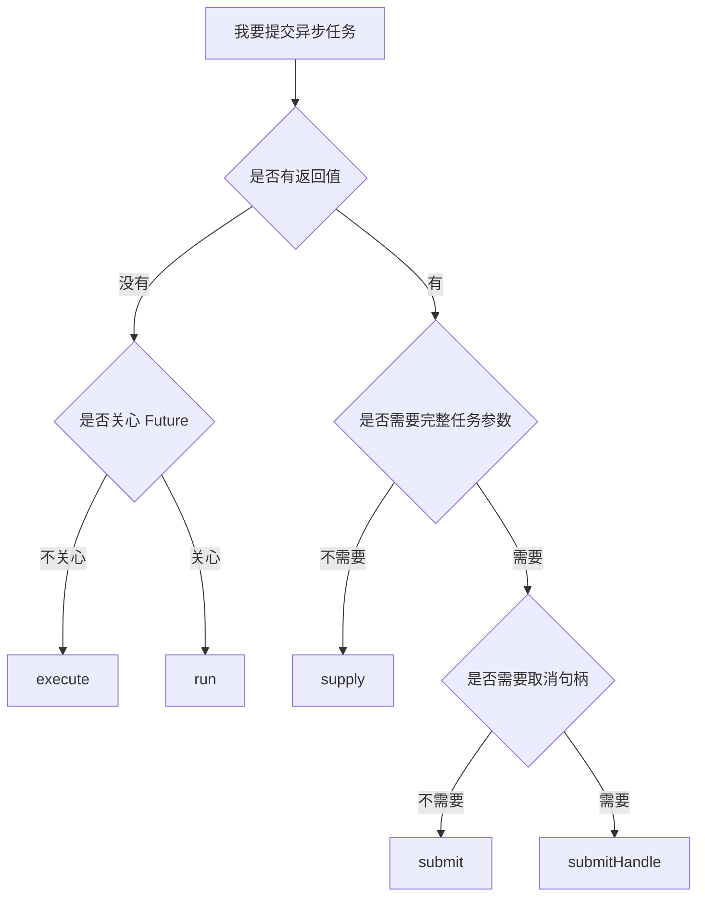

# USER_GUIDE：业务使用者手册

## 本文适合谁看

适合只想在业务代码中使用并行组件的人。

你不需要理解 `TaskCommand`、`TaskExecutionRuntime`、`TaskResultPipeline` 等内部类，也不应该在业务代码中直接使用它们。

## 读完你会知道什么

- 业务代码应该使用哪些接口。
- 每种任务应该怎么提交。
- 什么时候用 `run`、`supply`、`submit`、`submitHandle`、`execute`、`tryExecute`。
- 怎么配置超时、fallback、取消。
- 怎么监听任务完成。
- 怎么查询任务状态。

## 目录

- [1. 业务开发只需要关注哪些接口](#1-业务开发只需要关注哪些接口)
- [2. 最小接入](#2-最小接入)
- [3. 如何选择提交方法](#3-如何选择提交方法)
- [4. 无返回值任务](#4-无返回值任务)
- [5. 有返回值任务](#5-有返回值任务)
- [6. 完整任务模型](#6-完整任务模型)
- [7. 超时怎么用](#7-超时怎么用)
- [8. fallback 怎么用](#8-fallback-怎么用)
- [9. 取消怎么用](#9-取消怎么用)
- [10. 怎么监听任务生命周期](#10-怎么监听任务生命周期)
- [11. 怎么查询任务状态](#11-怎么查询任务状态)
- [12. 业务开发不要直接使用哪些内部类](#12-业务开发不要直接使用哪些内部类)

## 1. 业务开发只需要关注哪些接口

业务代码推荐使用：

| 接口 / 类 | 类型 | 作用 |
|---|---|---|
| `AsyncExecutor` | Public API | 提交异步任务的主入口 |
| `AsyncTask` | Public API | 描述一个异步任务，包括线程池、名称、超时、fallback |
| `TaskHandle` | Public API | 带取消能力的任务句柄 |
| `TaskCancelResult` | Public API | 取消结果 |
| `AsyncTemplate` | Public API | 组合多个 `CompletableFuture` |
| `TaskExecutionListener` | Extension API | 监听任务生命周期 |
| `AsyncErrorClassificationRule` | Extension API | 自定义错误分类规则 |
| `ThreadPoolManager` | Public API | 查询或调整线程池 |
| `TaskExecutionRegistry` | Public API | 查询最近任务快照 |

业务代码不建议使用：

| 内部类 | 为什么不建议业务使用 |
|---|---|
| `TaskCommand` | 组件内部执行命令，封装状态、事件、Future 完成 |
| `TaskExecutionRuntime` | 内部状态机，不应由业务修改 |
| `TaskExecutionContext` | 内部上下文对象 |
| `TaskResultPipeline` | 内部 timeout/fallback 管道 |
| `RejectedTaskSupport` | 内部拒绝策略辅助类 |
| `CallerRunsAware` | 内部拒绝策略协作协议 |
| `ShutdownAbortAware` | 内部 shutdown 收口协议 |

## 2. 最小接入

Spring Boot 项目引入 starter 后，直接注入：

```java
@RequiredArgsConstructor
@RestController
@RequestMapping("/demo/user")
public class UserDemoController {

    private final AsyncExecutor asyncExecutor;

    @GetMapping("/{userId}")
    public UserDTO query(@PathVariable String userId) {
        return asyncExecutor.supply(
                "default",
                "queryUser",
                () -> queryUser(userId)
        ).join();
    }
}
```

## 3. 如何选择提交方法



| 方法 | 适用场景 | 返回值 |
|---|---|---|
| `execute` | fire-and-forget，不关心结果 | 无 |
| `tryExecute` | 尝试提交，不想抛异常 | boolean |
| `run` | 无返回值，但关心完成状态 | `CompletableFuture<Void>` |
| `supply` | 有返回值的简单任务 | `CompletableFuture<T>` |
| `submit` | 完整任务模型 | `CompletableFuture<T>` |
| `submitHandle` | 完整任务模型 + 取消能力 | `TaskHandle<T>` |

## 4. 无返回值任务

### 4.1 不关心结果

```java
asyncExecutor.execute(
        "default",
        "sendAuditLog",
        () -> auditService.send(log)
);
```

适合日志、通知、轻量异步动作。

### 4.2 关心是否成功

```java
CompletableFuture<Void> future = asyncExecutor.run(
        "default",
        "syncTag",
        () -> tagService.sync(userId)
);

future.whenComplete((unused, error) -> {
    if (error == null) {
        log.info("sync tag success");
    } else {
        log.warn("sync tag failed", error);
    }
});
```

## 5. 有返回值任务

```java
CompletableFuture<UserDTO> future = asyncExecutor.supply(
        "default",
        "queryUser",
        () -> userService.query(userId)
);

UserDTO user = future.join();
```

多个任务并行：

```java
CompletableFuture<UserDTO> userFuture = asyncExecutor.supply(
        "default",
        "queryUser",
        () -> userService.query(userId)
);

CompletableFuture<AccountDTO> accountFuture = asyncExecutor.supply(
        "default",
        "queryAccount",
        () -> accountService.query(userId)
);

UserDTO user = userFuture.join();
AccountDTO account = accountFuture.join();
```

## 6. 完整任务模型

```java
CompletableFuture<UserDTO> future = asyncExecutor.submit(
        AsyncTask.of(
                "default",
                "queryUserProfile",
                () -> userService.queryProfile(userId)
        )
        .taskId("query-user-profile-" + userId)
        .bizKey("userId=" + userId)
        .description("查询用户画像")
        .tag("scene", "profile")
        .timeout(Duration.ofSeconds(2))
        .queueTimeout(Duration.ofMillis(500))
        .cancelOnTimeout(true)
        .interruptOnTimeout(true)
        .fallback(error -> UserDTO.empty(userId))
);
```

常用参数：

| 参数 | 说明 |
|---|---|
| `executorName` | 使用哪个线程池 |
| `taskName` | 任务名称，用于指标、日志、排障 |
| `taskId` | 任务唯一标识，不传则自动生成 |
| `bizKey` | 业务键，比如订单号、用户号 |
| `tags` | 低基数标签，便于分类 |
| `timeout` | 结果超时 |
| `queueTimeout` | 排队超时 |
| `fallback` | 失败、超时、拒绝后的降级逻辑 |
| `cancelOnTimeout` | timeout 后是否尝试取消底层任务 |
| `interruptOnTimeout` | timeout 取消时是否 interrupt 线程 |

## 7. 超时怎么用

```java
AsyncTask.of(
        "default",
        "queryRemote",
        () -> remoteClient.query()
)
.timeout(Duration.ofSeconds(1))
.cancelOnTimeout(true)
.interruptOnTimeout(true);
```

注意：

```text
interrupt 不是强制杀死线程。
如果底层代码不响应中断，线程仍然可能继续运行。
所以远程调用、数据库调用仍然要配置自己的超时。
```

## 8. fallback 怎么用

```java
CompletableFuture<UserDTO> future = asyncExecutor.submit(
        AsyncTask.of(
                "default",
                "queryUser",
                () -> userService.query(userId)
        )
        .timeout(Duration.ofSeconds(1))
        .fallback(error -> UserDTO.empty(userId))
);
```

fallback 会在这些情况触发：

```text
原始任务 FAILED
原始任务 TIMEOUT
原始任务 REJECTED
```

fallback 成功后，最终 Future 正常返回 fallback 值，最终状态是：

```text
FALLBACK_SUCCESS
```

fallback 自己失败后，最终 Future 异常完成，最终状态是：

```text
FALLBACK_FAILED
```

## 9. 取消怎么用

### 9.1 通过 TaskHandle 取消

```java
TaskHandle<String> handle = asyncExecutor.submitHandle(
        AsyncTask.of(
                "default",
                "longTask",
                () -> longTaskService.execute()
        )
);

TaskCancelResult result = handle.cancel(true);
```

### 9.2 通过 taskId 取消

```java
TaskCancelResult result = asyncExecutor.cancel(
        "task-10001",
        true
);
```

取消结果：

| 结果 | 说明 |
|---|---|
| `CANCELLED` | 成功取消 |
| `ALREADY_COMPLETED` | 任务已经完成，无法取消 |
| `NOT_FOUND` | 当前 JVM 找不到该任务 |

## 10. 怎么监听任务生命周期

```java
@Component
public class BizTaskListener implements TaskExecutionListener {

    @Override
    public void onSuccess(TaskExecutionEvent event) {
        log.info("task success, taskId={}", event.getTaskId());
    }

    @Override
    public void onFailure(TaskExecutionEvent event) {
        log.warn("task failed, taskId={}, error={}",
                event.getTaskId(),
                event.getError().getMessage());
    }

    @Override
    public void onCompleted(TaskExecutionEvent event) {
        log.info("task completed, taskId={}, status={}",
                event.getTaskId(),
                event.getStatus());
    }
}
```

监听器不能改变任务结果。监听器异常会被组件隔离，不会让主任务失败。

## 11. 怎么查询任务状态

```java
TaskExecutionSnapshot snapshot = taskExecutionRegistry.get(taskId);
```

最近任务：

```java
List<TaskExecutionSnapshot> recent = taskExecutionRegistry.recent(100);
```

快照里通常包含：

```text
taskId
executorName
taskName
bizKey
status
executionMode
resultMode
timing
error
updatedAtMillis
```

## 12. 业务开发不要直接使用哪些内部类

```text
TaskDefinition：提交后不可变任务快照，业务不需要手工创建。
TaskExecutionContext：内部上下文，业务不应该保存或修改。
TaskExecutionRuntime：状态机对象，业务不应该直接设置状态。
TaskCommand：线程池实际执行的 Runnable，业务不应该 new。
TaskResultPipeline：timeout/fallback 管道，业务不应该直接调用。
RejectedTaskSupport：内部拒绝策略辅助类。
ShutdownAbortAware：内部 shutdown 收口协议。
```

业务使用者记住一条即可：

```text
提交任务用 AsyncExecutor；描述任务用 AsyncTask；取消任务用 TaskHandle；组合 Future 用 AsyncTemplate。
```
