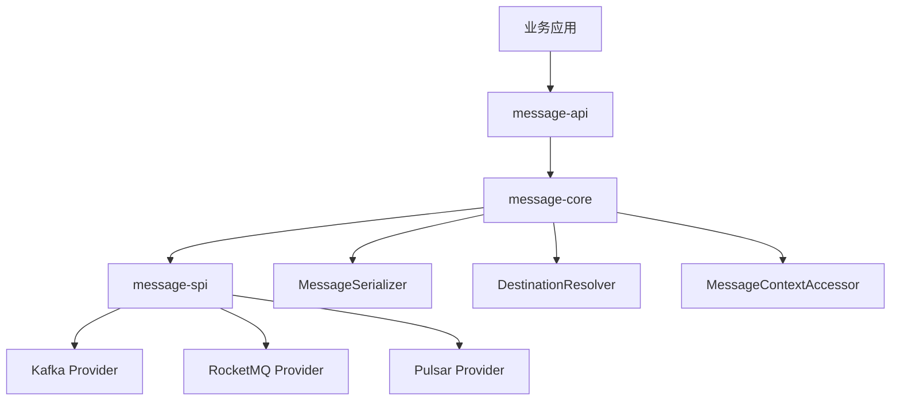

# 01. 总体架构

## 1. 组件定位

消息组件统一的是：

- 业务消息信封；
- 消息发送和消费生命周期；
- 发送结果；
- 消费决策；
- 逻辑目的地；
- Provider 选择；
- 上下文传播规则；
- 可观测和可靠性扩展位置。

消息组件不统一或不负责：

- Kafka partition 管理的全部能力；
- RocketMQ FIFO、事务、定时消息的全部语义；
- Pulsar Reader、Key_Shared、事务的全部语义；
- 业务幂等规则；
- 数据库本地事务与消息发送的一致性实现；
- 业务补偿流程；
- 消息管理控制台。

## 2. 分层



### message-api

只放业务需要直接使用、且跨 Provider 稳定的契约：

- `MessageEnvelope`
- `MessageContext`
- `MessageDestination`
- `MessagePublisher`
- `MessageConsumerRegistrar`
- `ConsumerDefinition`
- `ConsumeDecision`
- `SendResult`
- `MessageSerializer`

API 层不依赖 Kafka、RocketMQ、Pulsar。

### message-spi

只放 Provider 与 core 之间的线级契约：

- `MessageProvider`
- `ProviderDestination`
- `ProviderSendRequest`
- `ProviderSendResult`
- `ProviderInboundMessage`
- `ProviderSubscriptionRequest`
- `MessageCapability`

SPI 不把任何原生 SDK 类型泄漏给 core。

### message-core

`MessageTemplate` 是一期唯一生命周期编排器，负责：

- 参数校验；
- 信封丰富；
- 目的地解析；
- Provider 选择；
- 能力校验；
- 序列化；
- 线级系统头映射；
- Provider 结果标准化；
- 消费消息重建；
- 当前消息上下文作用域；
- `SUCCESS / RETRY` 决策传递。

没有额外建立 `DefaultMessageClient`、`MessageSendExecutor`、`MessageConsumeExecutor` 等类，因为一期还没有第二种生命周期实现。内部职责先通过清晰私有方法表达，避免为了分层而分层。

### integrations

每个 Provider 只负责：

- 把 `ProviderSendRequest` 转换为原生消息；
- 把原生发送回执转换为 `ProviderSendResult`；
- 把原生入站消息转换为 `ProviderInboundMessage`；
- 把 `ConsumeDecision` 映射为原生确认或重投动作；
- 管理原生 Producer、Consumer、Client 资源。

## 3. 依赖方向

```text
message-api
    ↑
message-spi ──→ message-api
    ↑
message-core ──→ message-api + message-spi
    ↑
integrations ──→ message-spi
    ↑
message-demo ──→ api + core + testkit
```

Provider 不依赖 core，避免第三方 Provider 被迫绑定核心实现细节。

## 4. 为什么拆出 message-spi

V1 把 Provider SPI 放在 API 中尚可运行，但随着同时实现三种 Provider，SPI 已经形成独立变化方向：

- API 面向业务稳定；
- SPI 面向 Provider 作者稳定；
- 两者兼容周期不同；
- Provider 不应看到业务门面之外的多余类型。

因此 V2 将 SPI 独立成模块，但没有进一步拆成十几个微模块。

## 5. 一期核心设计原则

1. 普通消息能力必须真正闭环，而不是只定义接口。
2. 三种 MQ 的公共模型不能被某一家原生术语绑架。
3. 不确定发送结果必须表达为 `UNKNOWN`。
4. 业务上下文与开放消息头分开建模。
5. 逻辑目的地与物理 Topic 分离。
6. 生产环境默认严格路由。
7. 消费默认至少一次取向。
8. 高级能力使用 Provider 专属接口，不污染公共 API。
