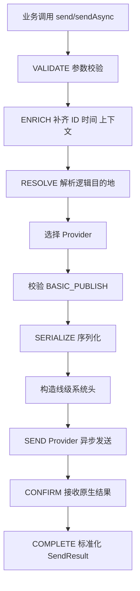
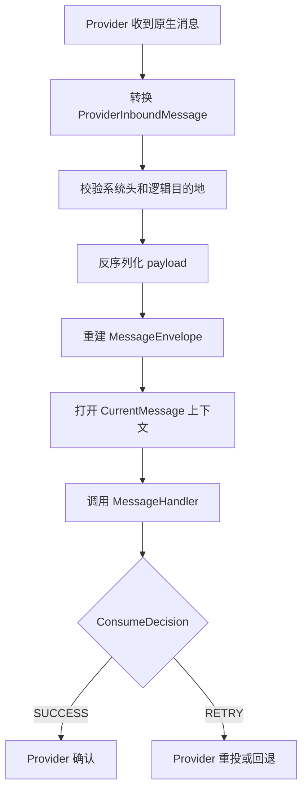

# 04. 生命周期与 Provider 映射

## 1. 发送生命周期



同步和异步 API 共用同一 Provider 异步 SPI：

```java
CompletionStage<ProviderSendResult> send(ProviderSendRequest request)
```

同步发送只是在 core 层等待结果并应用确认超时，避免每个 Provider 实现两套发送代码。

## 2. SendStatus

| 状态 | 含义 |
|---|---|
| CONFIRMED | 已得到明确成功回执 |
| REJECTED | 请求被参数、路由、权限或 Broker 明确拒绝 |
| FAILED | 明确客户端失败 |
| UNKNOWN | 无法确认 Broker 是否已接收或持久化 |

`UNKNOWN` 不能直接等于失败并无条件重发。网络超时、等待线程中断、异步 Future 异常都有可能发生在 Broker 已经接收消息之后。

## 3. SendStage

```text
VALIDATE
ENRICH
RESOLVE
SERIALIZE
SEND
CONFIRM
COMPLETE
```

结果同时包含 status、stage、failureType，避免把所有错误压缩为一个异常字符串。

## 4. 消费生命周期



任意未处理运行时异常和 null 决策都保守转换为 `RETRY`。

一期只有两个决策，是因为 `REJECT / DEAD_LETTER` 需要二期完整定义：

- 死信目的地；
- 最大次数；
- 死信发送失败；
- 审计；
- 人工补偿；
- 指标与告警。

## 5. Kafka 映射

### 发送

```text
ProviderSendRequest.destination.physicalName -> Topic
key                                          -> Record Key
headers                                      -> Kafka Headers UTF-8
body                                         -> byte[] value
RecordMetadata                               -> CONFIRMED
```

Producer 强制：

```text
StringSerializer
ByteArraySerializer
acks=all
```

公共稳定配置拥有最终优先级，调用方原生 properties 不能覆盖 serializer、bootstrap servers、clientId 和 `acks=all`。

### 消费

- 关闭自动提交；
- `SUCCESS` 后提交当前分区 `offset + 1`；
- `RETRY` 时 seek 回当前记录；
- 按分区分别处理 poll 批次；
- 某一分区失败只阻止该分区越过失败 offset，不会静默越过其他分区记录。

一期 `deliveryAttempt` 暂时为 1，因为 Kafka 原生记录没有统一重投次数字段。二期 Retry Topic 会显式维护尝试次数。

## 6. RocketMQ 映射

### 发送

```text
physicalName -> Topic
key          -> Keys
headers      -> User Properties
body         -> byte[]
SendReceipt  -> CONFIRMED
```

使用 RocketMQ 5.x gRPC Java Client。Producer 创建时需要预声明可发送 Topic，因此 Provider 配置包含 Topic 集合；发送未声明 Topic 会返回明确路由拒绝。

### 消费

```text
consumerGroup       -> Consumer Group
physicalName        -> Subscription Topic
SUCCESS             -> ConsumeResult.SUCCESS
RETRY               -> ConsumeResult.FAILURE
MessageView         -> ProviderInboundMessage
```

一期固定使用全量 Tag 表达式 `*`。Tag 过滤、FIFO、事务和定时消息不进入普通公共 API。

## 7. Pulsar 映射

### 发送

```text
physicalName -> Topic
key          -> Pulsar Key
headers      -> Properties
body         -> BYTES Schema
MessageId    -> CONFIRMED
```

Producer 按物理 Topic 缓存复用。

### 消费

```text
consumerGroup -> Subscription Name
subscription  -> Shared
SUCCESS       -> acknowledgeAsync
RETRY         -> negativeAcknowledge
```

ACK Future 失败时主动 negative acknowledge，选择允许重复而不是静默丢失。

Key_Shared、Reader、延时、事务进入三期专属能力。

## 8. 当前消息作用域

`ThreadLocalMessageContextAccessor` 在调用 Handler 前打开当前入站消息作用域，在 Handler 结束后恢复旧值。

作用：

- Handler 内发送子消息时自动取得父消息；
- 自动继承 correlationId；
- 自动建立 causationId；
- 自动继承 tenantId。

它只适用于 Handler 当前同步调用栈。业务自行切换线程时，二期需要结合 concurrency-component 的上下文传播能力。
